## 1.准备

RackNerd便宜服务器1台

- 成立于 2017 年，美国老牌服务器供应商
- 优先选择洛杉矶Los Angeles DC02、圣何塞San Jose
- 终身续费同价
- 3天内免费更换1次IP，不用担心失联
- 终身免费流量翻倍：只需要简单的福利回帖操作，就能翻倍
- 支付方式灵活，支持 PayPal、信用卡、支付宝
- 7x24小时客服，支持中文


| CPU  | 内存  | SSD硬盘 |      月流量带宽      |   优惠价格    |                           点击购买                           |
| :--: | :---: | :-----: | :------------------: | :-----------: | :----------------------------------------------------------: |
| 1 核 |  1 G  |  25 G   |  2 TB流量/月 @1Gbps  | **$10.6/年**  | **[官网链接](https://my.racknerd.com/aff.php?aff=17562&pid=923)** |
| 2 核 | 2.5 G |  45 G   |  3 TB流量/月 @1Gbps  | **$18.66/年** | **[官网链接](https://my.racknerd.com/aff.php?aff=17562&pid=924)** |
| 3 核 |  4 G  |  65 G   | 6.5 TB流量/月 @1Gbps | **$29.98/年** | **[官网链接](https://my.racknerd.com/aff.php?aff=17562&pid=925)** |
| 5 核 |  6 G  |  100 G  | 10 TB流量/月 @1Gbps  | **$44.98/年** | **[官网链接](https://my.racknerd.com/aff.php?aff=17562&pid=926)** |
| 6 核 |  8 G  |  150 G  | 20 TB流量/月 @1Gbps  | **$62.49/年** | **[官网链接](https://my.racknerd.com/aff.php?aff=17562&pid=927)** |


IP地址纯净度查询：https://www.ping0.cc/


## 2.流量翻倍教学

### 01-LET论坛注册账号

官方地址：https://lowendtalk.com/
注册理由what do you want to join？：

```bash
Hello, I would like to register for the forum and purchase a cost-effective VPS. Thank you！
```

 

 

如果没有使用魔法，注册信息填写完之后会报验证错误：the captcha was not completed correctly.please try again.

 

注册信息提交之后，邮箱会收到一封验证邮件

 

 

确认邮箱之后，大概过了20分钟左右才正式被激活。

 


### 02-获取RackNerd订单号

登录RackNerd后台，点击【view email log】可以看到之前购买服务器发送的发票邮件

https://my.racknerd.com/index.php?rp=/login

找到对应的服务器，复制invoice

 


### 03-LET论坛回帖申请

RackNerd流量翻倍帖子(任意可以）：

https://lowendtalk.com/discussion/211640/trending-now-racknerd-s-black-friday-new-deals-new-locations-new-hardware-100-s-of-giveaways#latest

如果注册账号还没有被激活，会看到以下页面，无法进行发帖或回复帖子

 

注册账号激活之后，再次打开申请帖子，拉到最底部回复帖子模板：

把12345678，换成你的订单号

```
Hello, I would like to double my bandwidth.
Invoice #12345678
Thanks!
```

 

正常大概3个工作日内，如果官方dustinc回复如下信息，说明流量翻倍成功。

实测11月4日提交，11月17日回复翻倍成功！可能这段时间促销旺季比较忙。

登录LET论坛，在消息提醒里面可以看到回复信息

 

点开之后就会跳转到回复的具体内容，类似这样的就算翻倍成功啦！

 

### 04-确认是否翻倍？

登录RackNerd后台，点开【Services】，打开翻倍的服务器

翻倍前流量

 

翻倍后流量

 


## 3.搭建vpn（弃用脚本方式）

SSH工具连接服务器

- 名称：任意自定义
- 主机：服务器的ip地址
- 端口：基本都是22
- 用户名：root
- 密码：服务器的root密码

### 3.1 系统升级组件安装

```bash
apt update -y && apt install -y curl && apt install -y socat
```

### 3.2 Hysteria2 一键安装脚本（开源安全）

```bash
wget -N --no-check-certificate https://raw.githubusercontent.com/flame1ce/hysteria2-install/main/hysteria2-install-main/hy2/hysteria.sh && bash hysteria.sh
```

**输入“1”：安装 Hysteria 2**

```bash
#############################################################
#                  Hysteria 2 一键安装脚本                  #
#############################################################

 1. 安装 Hysteria 2
 2. 卸载 Hysteria 2
 ------------------------------------------------------------
 3. 关闭、开启、重启 Hysteria 2
 4. 修改 Hysteria 2 配置
 5. 显示 Hysteria 2 配置文件
 ------------------------------------------------------------
 0. 退出脚本

请输入选项 [0-5]: 1
```

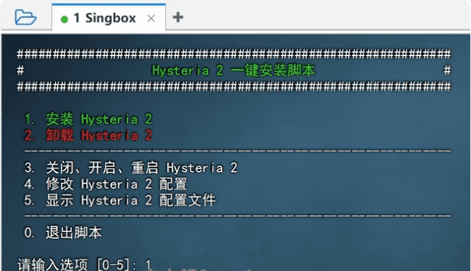 

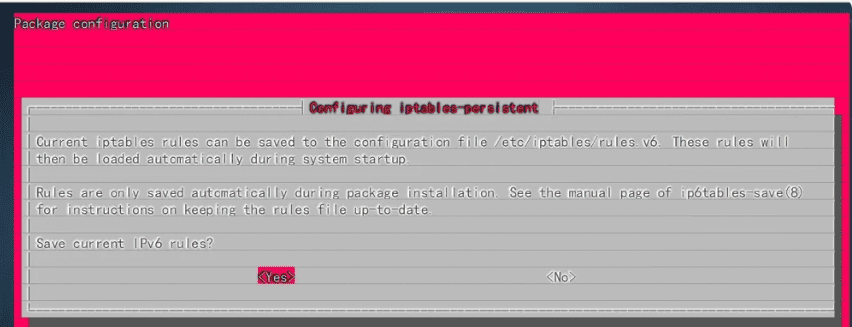 

### 3.3 配置Hysteria 2协议

⦁ 输入“1”：必应自签证书 （默认）
⦁ 回车：设置 Hysteria 2 端口为随机端口
⦁ 输入“1”：单端口 （默认）
⦁ 回车：设置 Hysteria 2 密码为随机密码
⦁ 设置Hysteria 2 的伪装网站地址：输入“www.bing.com”

```bash
aws.com
amd.com
bing.com
go.microsoft.com
snap.licdn.com
devblogs.microsoft.com
cdn.bizibly.com
www.apple.com
ts1.tc.mm.bing.net
fpinit.itunes.apple.com
catalog.gamepass.com
gray-config-prod.api.arc-cdn.net
apps.mzstatic.com
tag.demandbase.com
r.bing.com
tag-logger.demandbase.com
cdn-dynmedia-1.microsoft.com
services.digitaleast.mobi
gray.video-player.arcpublishing.com
azure.microsoft.com
beacon.gtv-pub.com
```

日志

```bash
Hysteria 2 安装成功！
Hysteria 2 协议证书申请方式如下：

 1. 必应自签证书 （默认）
 2. Acme 脚本自动申请
 3. 自定义证书路径

请输入选项 [1-3]: 1
将使用必应自签证书作为 Hysteria 2 的节点证书
设置 Hysteria 2 端口 [1-65535]（回车则随机分配端口）：
将在 Hysteria 2 节点使用的端口是：11075
Hysteria 2 端口使用模式如下：

 1. 单端口 （默认）
 2. 端口跳跃

请输入选项 [1-2]: 1
将继续使用单端口模式
设置 Hysteria 2 密码（回车跳过为随机字符）：
使用在 Hysteria 2 节点的密码为：db53d5f1
请输入 Hysteria 2 的伪装网站地址 （去除https://） [默认首尔大学]：www.bing.com
使用在 Hysteria 2 节点的伪装网站为：www.bing.com
```

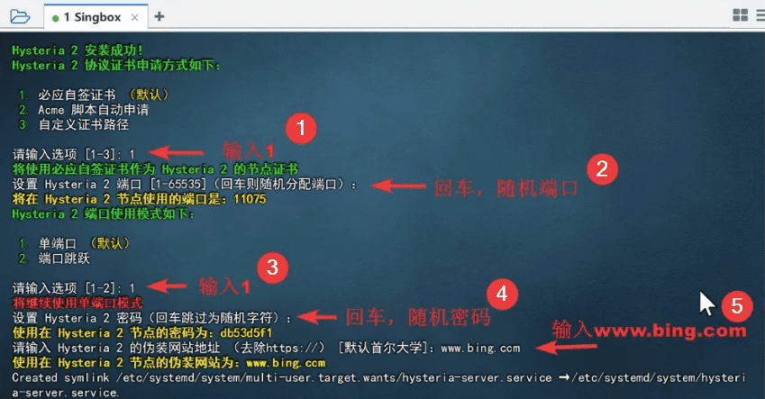 

### 3.4 保存Hysteria 2协议节点链接

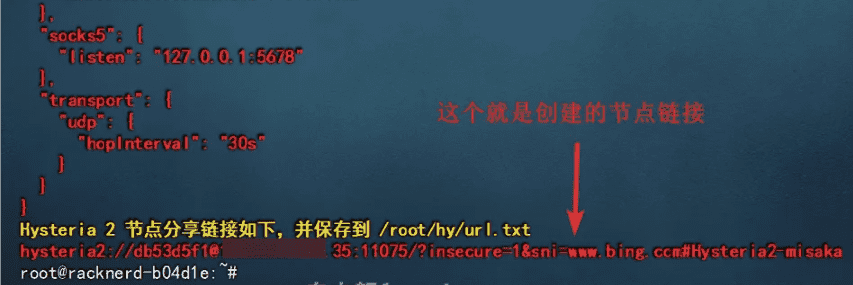 


### 3.5 客户端配置

- Windows（v2rayN）：https://github.com/2dust/v2rayN/releases （下载v2rayN-windows-64-SelfContained.zip版）
- Android（v2rayNG）：https://github.com/2dust/v2rayNG/releases
- Mac（v2rayN）：https://github.com/2dust/v2rayN/releases
- IOS（shadowrocket）：https://apps.apple.com/app/shadowrocket/id932747118

扫描二维码、或复制粘贴链接导入客户端


### 3.6 如何查看更改配置

还是输入安装代码，可以【修改配置】、【显示配置文件】等

```bash
wget -N --no-check-certificate https://raw.githubusercontent.com/flame1ce/hysteria2-install/main/hysteria2-install-main/hy2/hysteria.sh && bash hysteria.sh
```

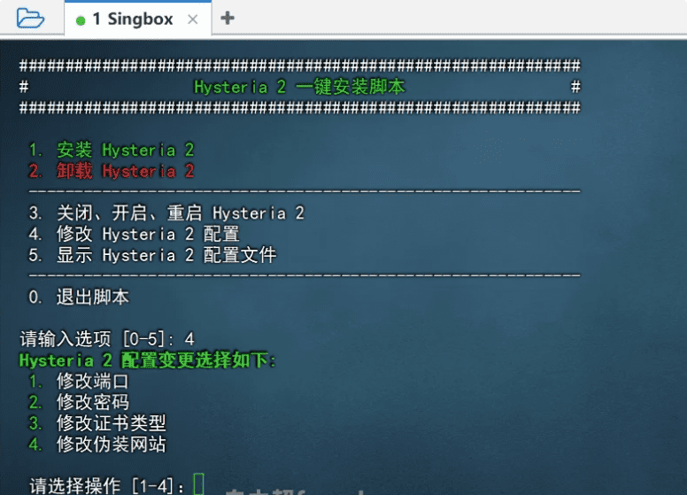 

郑重声明：请合理使用科学上网，用于学习、科研、外贸等，严格遵守当地相关规定！


## 4.搭建vpn（推荐s-ui面板方式）

### 4.1 卸载旧版vpn

还是输入安装代码，可以卸载等

```bash
wget -N --no-check-certificate https://raw.githubusercontent.com/flame1ce/hysteria2-install/main/hysteria2-install-main/hy2/hysteria.sh && bash hysteria.sh
```

### 4.2 绑定域名防墙

登录：https://dash.cloudflare.com/

域名获取：

免费白嫖永久域名：https://www.youtube.com/watch?v=aZGlGjn4OHM

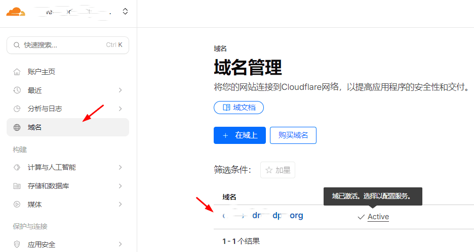 

添加DNS解析，到你的vps节点

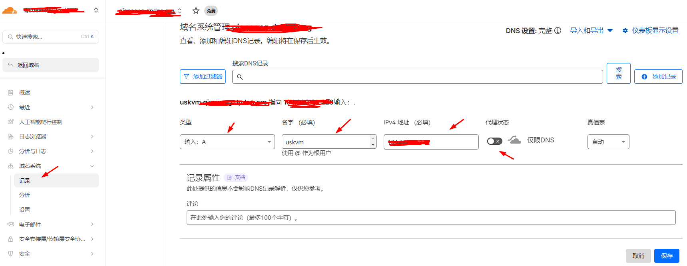 


### 4.3 一键安装与卸载

[官方文档](https://v2.hysteria.network/zh/docs/getting-started/Server-Installation-Script/)

安装；https://github.com/xiaochaib/chaiwiki/wiki/

```bash
#安装git
yum install git bash-completion vim -y
yum update -y && yum install -y curl socat wget

#关闭防火墙
[root@racknerd-0566bb5 ~/acme]# systemctl status nftables.service

[root@racknerd-0566bb5 ~/acme]# systemctl status iptables.service

[root@racknerd-0566bb5 ~/acme]# systemctl status firewalld.service
[root@racknerd-0566bb5 ~/acme]# systemctl disable firewalld.service --now
[root@racknerd-0566bb5 ~/acme]# systemctl status firewalld.service

#安装S-UI
#地址：https://github.com/alireza0/s-ui
bash <(curl -Ls https://raw.githubusercontent.com/alireza0/s-ui/master/install.sh)

===================================
###############################################
username:fNrrlphy
password:qxAGy240
###############################################
if you forgot your login info,you can type s-ui for configuration menu
reset admin credentials success
First admin credentials:
        Username:        fNrrlphy
        Password:        qxAGy240
Created symlink /etc/systemd/system/multi-user.target.wants/s-ui.service → /etc/systemd/system/s-ui.service.
s-ui vv1.3.7 installation finished, it is up and running now...
You may access the Panel with following URL(s):
Local address:
http://your_ip:2095/app/

Global address:
http://your_ip:2095/app/


The OS release is: almalinux
S-UI Control Menu Usage
------------------------------------------
SUBCOMMANDS:
s-ui              - Admin Management Script
s-ui start        - Start s-ui
s-ui stop         - Stop s-ui
s-ui restart      - Restart s-ui
s-ui status       - Current Status of s-ui
s-ui enable       - Enable Autostart on OS Startup
s-ui disable      - Disable Autostart on OS Startup
s-ui log          - Check s-ui Logs
s-ui update       - Update
s-ui install      - Install
s-ui uninstall    - Uninstall
s-ui help         - Control Menu Usage
------------------------------------------
```

显示三行红字, 代表安装成功

设置开机自启

```bash
[root@racknerd-0566bb5 ~]# systemctl daemon-reload
[root@racknerd-0566bb5 ~]# systemctl enable s-ui
[root@racknerd-0566bb5 ~]# systemctl restart s-ui
[root@racknerd-0566bb5 ~]# systemctl status s-ui.service
● h-ui.service - h-ui Service
     Loaded: loaded (/etc/systemd/system/h-ui.service; enabled; preset: disabled)
     Active: active (running) since Tue 2025-12-30 23:08:46 CST; 17s ago
   Main PID: 58208 (h-ui)
      Tasks: 4 (limit: 5928)
     Memory: 40.0M
        CPU: 380ms
     CGroup: /system.slice/h-ui.service
             └─58208 /usr/local/h-ui/h-ui

Dec 30 23:08:47 racknerd-0566bb5 h-ui[58208]: [GIN-debug] POST   /hui/hysteria2/hysteria2Kick --> h-ui/controller.Hysteria2Kick (8 handlers)
Dec 30 23:08:47 racknerd-0566bb5 h-ui[58208]: [GIN-debug] POST   /hui/hysteria2/hysteria2ChangeVersion --> h-ui/controller.Hysteria2ChangeVersion (8 handlers)
```

挑选SNI伪装域名（任选一个）

```
如发现节点不能使用，或延迟显示-1，以下域名请随机挑选用于SNI，直到正常使用即可，或者直接照抄视频中一模一样的域名填写，确保可用
aws.com
bing.com
snap.licdn.com
devblogs.microsoft.com
cdn.bizibly.com
www.apple.com
ts1.tc.mm.bing.net
fpinit.itunes.apple.com
go.microsoft.com
catalog.gamepass.com
gray-config-prod.api.arc-cdn.net
apps.mzstatic.com
tag.demandbase.com
r.bing.com
tag-logger.demandbase.com
cdn-dynmedia-1.microsoft.com
services.digitaleast.mobi
gray.video-player.arcpublishing.com
azure.microsoft.com
beacon.gtv-pub.com
amd.com
```

**BBR加速**

输入s-ui运行，输入18运行，输入1运行，开启BBR加速，显著提升速度

```
s-ui state: Running
Start s-ui automatically: Yes

Please enter your selection [0-20]: 18
        1. Enable BBR
        2. Disable BBR
        0. Back to Main Menu
Choose an option: 1
Last metadata expiration check: 1:19:50 ago on Tue 30 Dec 2025 11:24:05 PM CST.
Error:
 Problem: cannot install both initscripts-10.11.8-4.el9.x86_64 from baseos and initscripts-10.11.4-1.el9.x86_64 from @System
  - package network-scripts-10.11.4-1.el9.x86_64 from @System requires initscripts(x86-64) = 10.11.4-1.el9, but none of the providers can be installed
  - cannot install the best update candidate for package initscripts-10.11.4-1.el9.x86_64
  - problem with installed package network-scripts-10.11.4-1.el9.x86_64
(try to add '--allowerasing' to command line to replace conflicting packages or '--skip-broken' to skip uninstallable packages or '--nobest' to use not only best candidate packages)
net.core.default_qdisc=fq
net.ipv4.tcp_congestion_control=bbr
net.core.default_qdisc = fq
net.ipv4.tcp_congestion_control = bbr
BBR has been enabled successfully.
```

卸载

```bash
sudo -i

systemctl disable s-ui  --now

rm -f /etc/systemd/system/sing-box.service
systemctl daemon-reload

rm -fr /usr/local/s-ui
rm /usr/bin/s-ui
```

### 4.4 服务端配置

http://your_ip:2095/app/

https://www.youtube.com/watch?v=6l01iAgKglY&t=10s

修改管理员账号密码

账号：你懂得.......

密码：你懂得.........

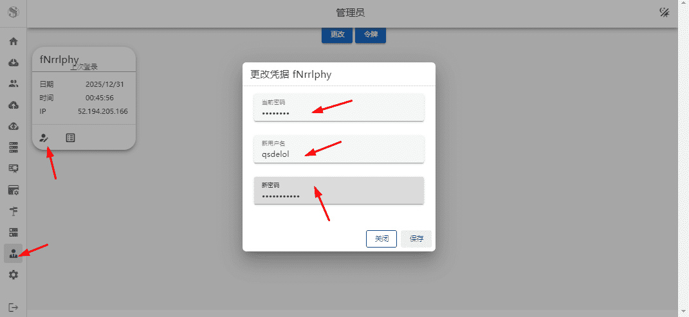 

添加tls证书路径

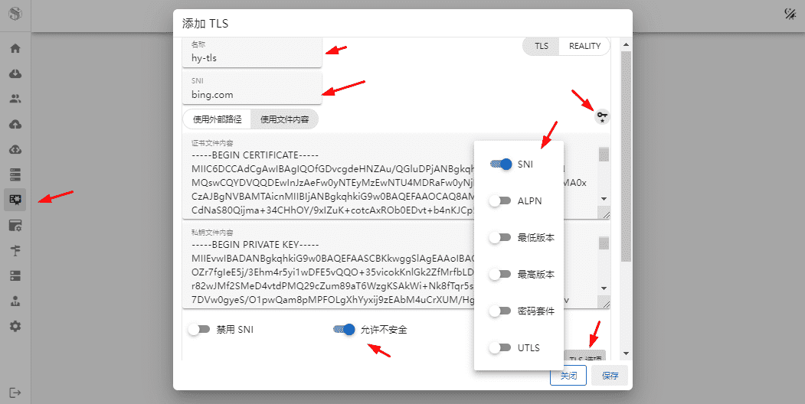 

配置入站

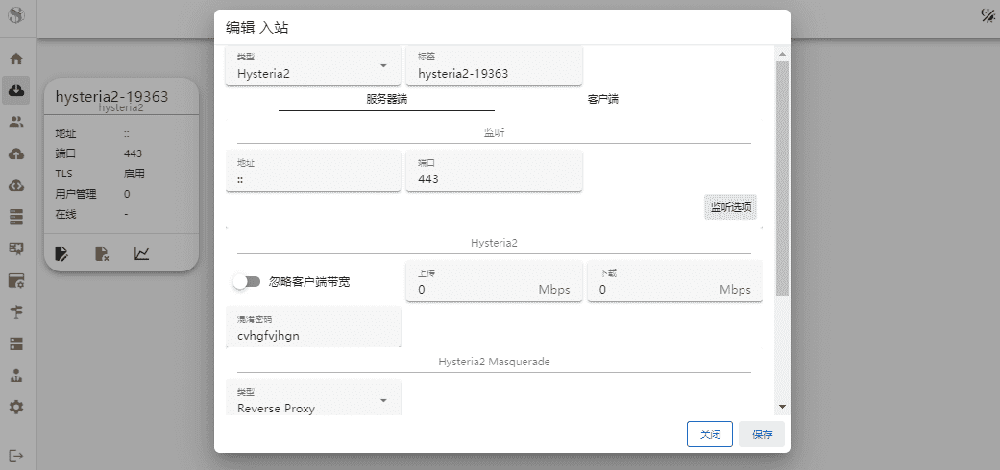 

 配置用户

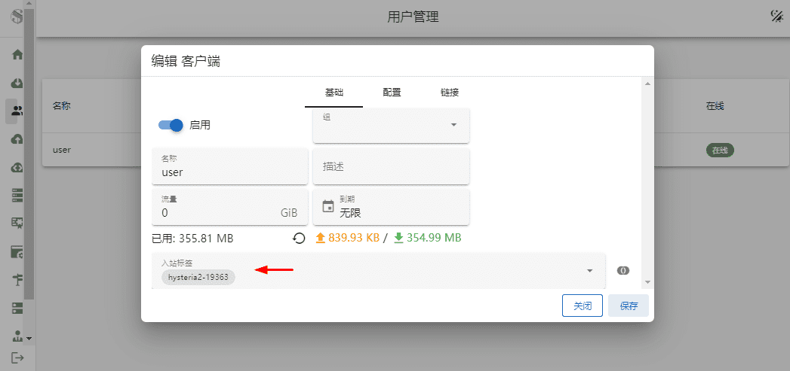 


### 4.5 开放端口

```bash
#如果上方失败，开放端口试试
➜ sudo nft add rule inet filter INPUT udp dport 443 accept
➜ sudo nft add rule inet filter INPUT tcp dport 2095 accept
➜ sudo nft list ruleset
table inet hui_porthopping {
        chain prerouting {
                type nat hook prerouting priority dstnat; policy accept;
        }
}
table inet filter {
        chain INPUT {
                type filter hook input priority filter; policy drop;
                tcp dport 22 accept
                iifname "lo" accept
                icmp type echo-request accept
                ct state established,related accept
                udp dport 443 accept
                tcp dport 2095 accept
        }

        chain FORWARD {
                type filter hook forward priority filter; policy accept;
        }

        chain OUTPUT {
                type filter hook output priority filter; policy accept;
                oifname "lo" accept
                ct state established,related accept
        }
}

#保存配置
➜ sudo nft list ruleset > /etc/nftables/full.nft
➜ vim /etc/sysconfig/nftables.conf
➜ cat /etc/sysconfig/nftables.conf
include "/etc/nftables/full.nft"

#重启防火墙
➜ systemctl restart nftables.service

#查看状态
➜ systemctl status nftables.service

#成功启动
➜ ss -tunpl
Netid       State        Recv-Q       Send-Q              Local Address:Port               Peer Address:Port       Process
udp         UNCONN       0            0                      127.0.0.54:53                      0.0.0.0:*           users:(("systemd-resolve",pid=433,fd=16))
udp         UNCONN       0            0                   127.0.0.53%lo:53                      0.0.0.0:*           users:(("systemd-resolve",pid=433,fd=14))
udp         UNCONN       0            0                               *:443                           *:*           users:(("hysteria",pid=4460,fd=3))
tcp         LISTEN       0            4096                127.0.0.53%lo:53                      0.0.0.0:*           users:(("systemd-resolve",pid=433,fd=15))
tcp         LISTEN       0            4096                   127.0.0.54:53                      0.0.0.0:*           users:(("systemd-resolve",pid=433,fd=17))
tcp         LISTEN       0            4096                            *:22                            *:*           users:(("sshd",pid=755,fd=3),("systemd",pid=1,fd=199))

```


### 4.6 客户端 配置

```bash
#电脑配置
server: your.domain.net:443 #你的vps的已经解析的域名
auth: Se7RAuFZ8Lzg #密码，需要与服务端一样

bandwidth:
  up: 20 mbps #你家宽带的上传速度
  down: 100 mbps #下载速度
  
tls:
  sni: your.domain.net #你的域名，为空将和server一致，通常留空
  insecure: false #使用自签时需要改成true

socks5:
  listen: 127.0.0.1:1080

http:
  listen: 127.0.0.1:8080
  
#手机配置
================================================
服务器地址: 192.3.85.247 --你的vps地址
服务器端口: 443  --默认
密码：Se7RAuFZ8Lzg  --密码，需要与服务端一样
宽带速率设置：500M  --你家宽带的上传下载速度
传输层安全tls：
SNI：your.domain.net  --你的域名，为空将和server一致，通常留空
跳过证书：false  --仅自签证书时改为true
```

**安卓/Android：**[NekoBox下载](https://github.com/MatsuriDayo/NekoBoxForAndroid/releases/tag/1.4.0)

扫码或复制链接，粘贴导入

开启代理

**cloudflare --域名--dns系统--解析--把代理开启--小云朵亮起来**


## 5.给面板和节点隧道访问

**作用：防止被扫描，封IP**

视频教程：https://www.youtube.com/watch?v=VtVCupq-Gsw

教程：https://amclubss.com/argo

你的 VPS IP 被封？别慌！教你用 Cloudflare Argo Tunnel 一键恢复被封的 VPS 节点。

**仅支持 VLESS / Trojan / Vmess / WebSocket / gRPC / TCP 多协议**


### 5.1 创建s-ui节点

创建无tls的节点，如 VLESS / Trojan / Vmess 等等协议

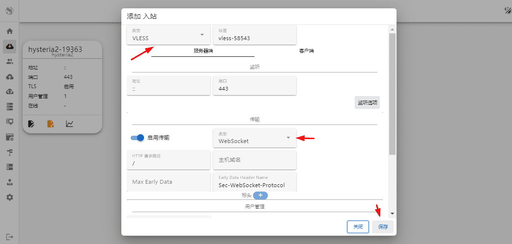 

配置用户，把节点加入

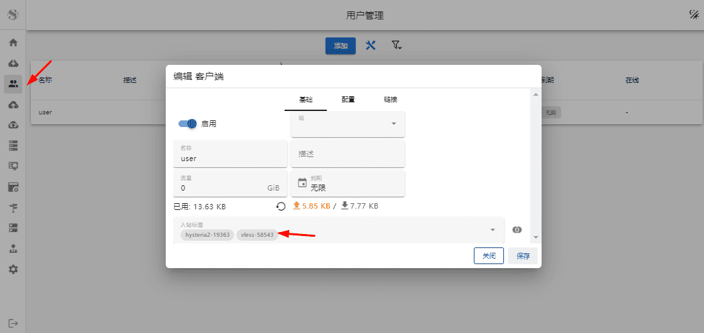 


### 5.2 端口知识

**s-ui配置Cloudflare的CDN和TLS证书**
**面板加CDN、节点加CDN配置Cloudflare的15年证书使用，或隧道代理都需要遵守，使用以下标准端口**

**cloudflare标准 端口 知识**

> - 80系端口(HTTP)：80，8080，8880，2052，2082，2086，2095
> - 443系端口(HTTPS)：443，2053，2083，2087，2096，8443

修改s-ui面板配置，支持正常端口

```bash
[root@racknerd-0566bb5 ~]# s-ui
————————————————————————————————
  8. Reset Panel Settings
  9. Set Panel settings
  10. View Panel Settings
————————————————————————————————
Please enter your selection [0-20]: 9
Enter the panel port (leave blank for existing/default value):
2095  --修改面板访问端口
Enter the panel path (leave blank for existing/default value):
app   --修改模板路径
Enter the subscription port (leave blank for existing/default value):
2096  --修改订阅地址端口
Enter the subscription path (leave blank for existing/default value):
sub   --修改订阅路径
Initializing, please wait...
set port success
set path success
set sub port success
set sub path success
Current panel settings:
        Panel port:      2095
        Panel path:      /app/

Current subscription settings:
        Sub port:        2096
        Sub path:        /sub/
        
#重启面板生效
————————————————————————————————
  11. S-UI Start
  12. S-UI Stop
  13. S-UI Restart
  14. S-UI Check State
  15. S-UI Check Logs
  16. S-UI Enable Autostart
  17. S-UI Disable Autostart
————————————————————————————————
  18. Enable or Disable BBR
  19. SSL Certificate Management
  20. Cloudflare SSL Certificate
————————————————————————————————

s-ui state: Running
Start s-ui automatically: Yes

Please enter your selection [0-20]: 13
```


### 5.3 关闭端口

```bash
#关闭所有暴露端口
[root@racknerd-0566bb5 ~]# vim /etc/nftables/full.nft
[root@racknerd-0566bb5 ~]# cat /etc/nftables/full.nft
table inet filter {
        chain INPUT {
                type filter hook input priority filter; policy drop;
                tcp dport 22 accept
                iifname "lo" accept
                icmp type echo-request accept
                ct state established,related accept
                udp dport 443 accept
        }

        chain FORWARD {
                type filter hook forward priority filter; policy accept;
        }

        chain OUTPUT {
                type filter hook output priority filter; policy accept;
                oifname "lo" accept
                ct state established,related accept
        }
}
table inet hui_porthopping {
        chain prerouting {
                type nat hook prerouting priority dstnat; policy accept;
        }
}

#生效配置
[root@racknerd-0566bb5 ~]# systemctl restart nftables.service
[root@racknerd-0566bb5 ~]# nft list ruleset
table inet filter {
        chain INPUT {
                type filter hook input priority filter; policy drop;
                tcp dport 22 accept
                iifname "lo" accept
                icmp type echo-request accept
                ct state established,related accept
                udp dport 443 accept
        }

        chain FORWARD {
                type filter hook forward priority filter; policy accept;
        }

        chain OUTPUT {
                type filter hook output priority filter; policy accept;
                oifname "lo" accept
                ct state established,related accept
        }
}
table inet hui_porthopping {
        chain prerouting {
                type nat hook prerouting priority dstnat; policy accept;
        }
}

#查看端口
[root@racknerd-0566bb5 ~]# ss -tunpl
Netid        State         Recv-Q        Send-Q               Local Address:Port                Peer Address:Port        Process
udp          UNCONN        0             0                        127.0.0.1:323                      0.0.0.0:*            users:(("chronyd",pid=43595,fd=5))
udp          UNCONN        0             0                            [::1]:323                         [::]:*            users:(("chronyd",pid=43595,fd=6))
udp          UNCONN        0             0                                *:443                            *:*            users:(("sui",pid=75637,fd=12))
tcp          LISTEN        0             128                        0.0.0.0:22                       0.0.0.0:*            users:(("sshd",pid=28841,fd=3))
tcp          LISTEN        0             4096                             *:2095                           *:*            users:(("sui",pid=75637,fd=7))
tcp          LISTEN        0             4096                             *:2096                           *:*            users:(("sui",pid=75637,fd=8))
tcp          LISTEN        0             128                           [::]:22                          [::]:*            users:(("sshd",pid=28841,fd=4))
```

此时访问：http://your_global_ip:2095/app/ 是不能访问面板的

### 5.4 ssh隧道访问面板

Windows终端走ssh端口转发

**SSH 端口转发（SSH Port Forwarding）**，通常也被称为 SSH 隧道，是一种利用 SSH 协议将网络数据包封装在加密通道中进行传输的技术。它不仅能保障数据安全，还能帮助我们访问原本受限的网络资源。
根据数据传输方向的不同，主要分为以下三种模式：

1. **本地端口转发 (Local Port Forwarding)**
    场景： 你在家里，想访问公司内网的一台数据库服务器，但数据库端口不对外开放，只有 SSH 服务器可以从外部访问。

  >  * 原理： 在本地机器上监听一个端口，将发送到该端口的数据通过 SSH 隧道转发到远程主机的某个端口。
  >  * 命令格式：
  >    ssh -L [本地地址:]本地端口:目标主机:目标端口 SSH用户@SSH服务器
  >  * 示例：
  >    ssh -L 8080:192.168.1.50:3306 user@ssh-server.com
  >    这表示：当你访问本地的 localhost:8080 时，流量会通过 ssh-server.com 转发到内网 192.168.1.50 的 3306 端口。
2. **远程端口转发 (Remote Port Forwarding)**
    场景： 你在公司内部开发了一个网页，想让家里的朋友看看，但公司没有公网 IP。

  >  * 原理： 在远程 SSH 服务器上监听一个端口，将发送到该端口的数据通过 SSH 隧道转发回本地机器的某个端口。
  >  * 命令格式：
  >    ssh -R [远程地址:]远程端口:目标主机:目标端口 SSH用户@SSH服务器
  >  * 示例：
  >    ssh -R 9000:localhost:80 user@public-server.com
  >    这表示：任何人访问 public-server.com:9000，流量都会被转发到你本地机器的 80 端口。
3. **动态端口转发 (Dynamic Port Forwarding)**
    场景： 你需要一个通用的代理服务器，想通过 SSH 服务器访问多个不同的外部网站，而不必为每个目标都设置转发。

  >  * 原理： SSH 会启动一个 SOCKS 代理服务器。流量不再固定转发到某个特定目标，而是根据应用层的需求动态决定去向。
  >  * 命令格式：
  >    ssh -D 本地端口 SSH用户@SSH服务器
  >  * 示例：
  >    ssh -D 1080 user@ssh-server.com
  >    这表示：在本地开启了 SOCKS5 代理。你在浏览器设置代理为 localhost:1080 后，所有上网流量都会经过 SSH 服务器代为发出。

常用参数说明

| 参数         | 说明                                             |
| ------------ | ------------------------------------------------ |
| -N           | 不执行远程命令（仅用于转发端口，不进入 Shell）。 |
| -f           | 后台运行 SSH 会话。                              |
| -L / -R / -D | 分别对应本地、远程、动态转发。                   |
| -C           | 压缩数据，提高传输效率。                         |

💡 提示
如果你是在 Linux 或 macOS 上操作，直接在终端输入命令即可；

如果是 Windows，推荐使用 PowerShell 或 PuTTY（PuTTY 在 Connection -> SSH -> Tunnels 中设置）。

你想针对某个具体的应用场景（如数据库连接或绕过防火墙）获取更详细的配置步骤吗？

```bash
#开启ssh隧道，替换your-vps-ip，为你的vps服务器IP地址
PS C:\Users\Fizz\Desktop> ssh -N -L 8080:localhost:2095 root@your-vps-ip
```

访问 ：http://127.0.0.1:8080/app/ 即可开启s-ui面板

### 5.5 配置C-F隧道

登录：https://dash.cloudflare.com/

点这个

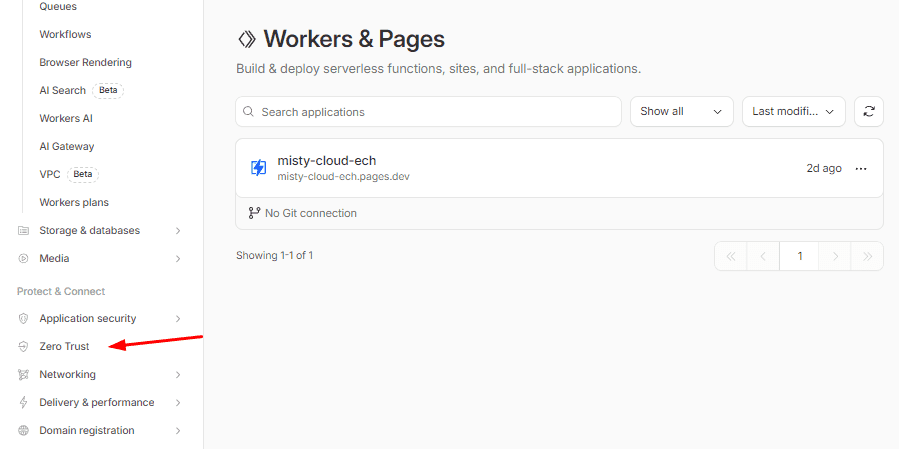 

 点这个

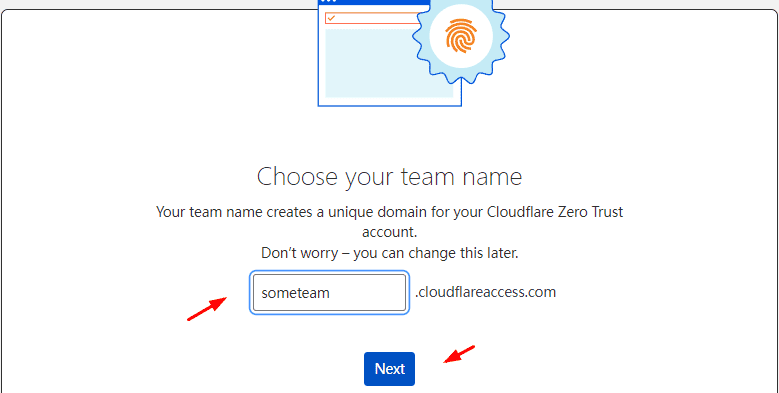 

选这个

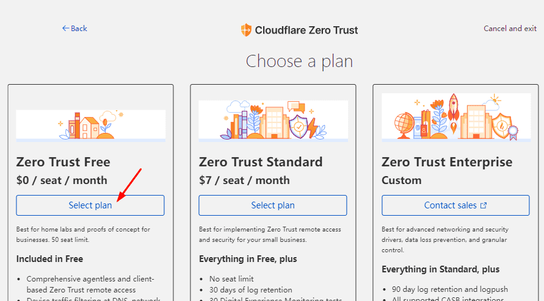 

点这个

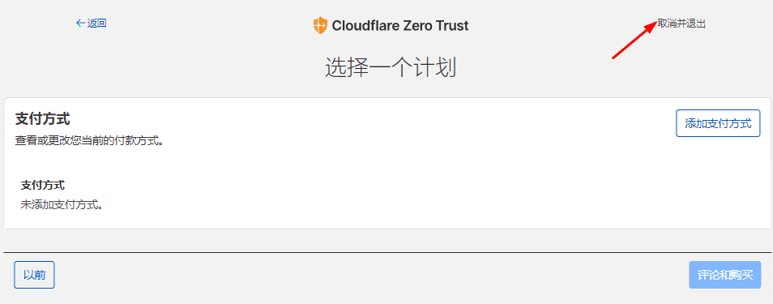 

继续点击**zero turst**

点击这个

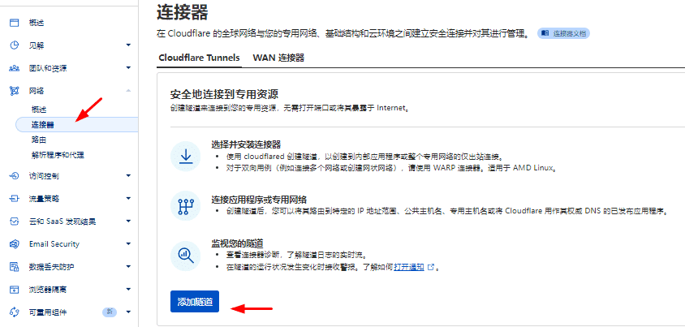 

点这个

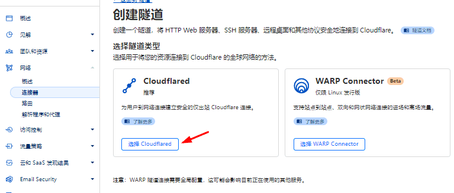 

点这个

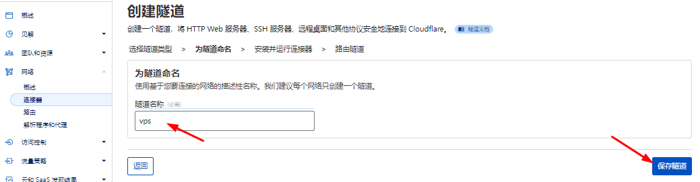 

复制密钥，下一步

**把密钥保存在一个临时文件，后边要用**

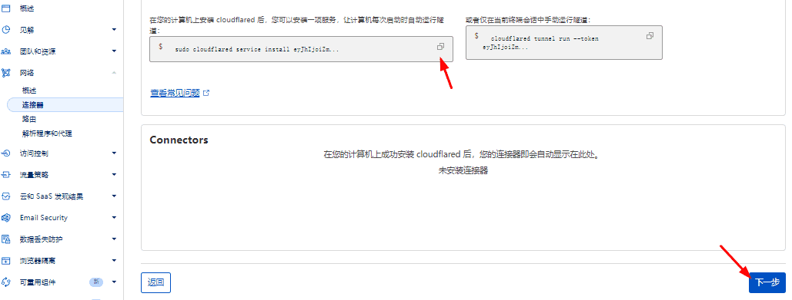 

点这个，添加域名到vps端口映射

> [!NOTE]
>
> > **第一个节点就：node1**
> >
> > **第二个节点就：node2**
> >
> > **........**
> >
> > **比如你使用s-ui面板，添加了vps节点**
> >
> > **开启了一个http类型的节点，监听端口443，就这样写：http://localhost:443**

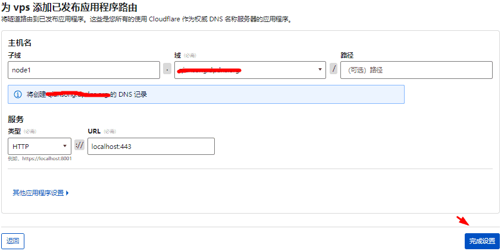 

之后要添加其它隧道节点，点这个

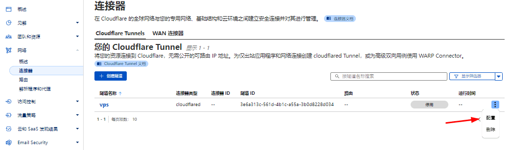 

安装隧道

```bash
#教程：https://amclubss.com/argo
bash <(curl -Ls https://raw.githubusercontent.com/amclubs/am-serv00-vmess/main/install-argo.sh)


╔══════════════════════════════════════════╗
║   🚀 数字套利 Cloudflare Argo 安装器        ║
╚══════════════════════════════════════════╝

\033[0;32m📺 YouTube频道： https://youtube.com/@am_clubs
\033[0;32m💬 TG交流群组： https://t.me/am_clubs
\033[0;32m💻 GitHub仓库： https://github.com/amclubs
\033[0;32m🌐 个人博客： https://amclubss.com
──────────────────────────────────────────
1) 安装 Argo Tunnel
2) 卸载 Argo Tunnel
3) 退出脚本

→ 请选择操作 (1/2/3): 1

🟢 进入安装流程...
Last metadata expiration check: 2:03:46 ago on Wed 31 Dec 2025 11:54:33 PM CST.
Package curl-7.76.1-34.el9.x86_64 is already installed.
Package wget-1.21.1-8.el9_4.x86_64 is already installed.
Dependencies resolved.
Nothing to do.
Complete!
→ 正在安装 cloudflared...
→ ✅ cloudflared 安装完成： /usr/local/bin/cloudflared
→ 检测到 cloudflared 版本：2025.11.1
  ✔ 新版 cloudflared 检测到，将启用新版兼容模式（不使用 --config 参数）

需要配置多少个域名->端口？(例如 2)： 1 #根据你面板配置的节点数，这里我选择1，我只配置了一个节点

#配置域名-入口-隧道-配置-已配置域名。复制粘贴
=== 配置第 1 个域名 ===
请输入要绑定的域名（Public Hostname）： node1.xxx.xxx.org #你的cloudflare隧道配置的节点域名
请输入本地监听端口（默认 443）： 443 #你的s-ui节点的端口

请选择传输方式：
1) WebSocket（默认）
2) gRPC
3) TCP
选择传输类型 (1/2/3，默认 1)： 1 #通常都是WebSocket
请输入 WebSocket 路径（默认 /）： / #通常也是/
请输入协议类型 (http/https/tcp，默认 http)： http #推荐http，根据节点不含tls，以及你的cloudflare隧道配置也是http

请选择凭证方式：
1) Cloudflare Token（推荐）
2) credentials JSON（直接粘贴内容）
选择 (1/2) 默认 1： 1 #Cloudflare Token（推荐）
请输入 Cloudflare Tunnel Token（以 eyJ 开头）： eyJh #你的cloudflare-(zere-trust)-入口-隧道-配置-已配置域名。复制粘贴

#报错
===========================================================================
✖ Cloudflared 启动失败！
------------------------------------------------------------
可能原因如下：
  [1] 凭证 Token 或 credentials JSON 无效（登录 Cloudflare Zero Trust 检查）
  [2] config.yml 格式错误（缩进或冒号错位）
  [3] 端口未开放 / 被占用（检查端口是否被其他进程使用）
  [4] 网络被防火墙或代理阻断（cloudflared 无法连接 Cloudflare）
------------------------------------------------------------
📋 快速排查命令：
  journalctl -u cloudflared -n 50 --no-pager
  systemctl status cloudflared
------------------------------------------------------------
❗ 解决后可执行： systemctl restart cloudflared

⚠️ 安装未成功，请先排查上述问题后重试。
==========================================================================

#编辑服务配置，去掉--config参数
[root@racknerd-0566bb5 ~]# cat /etc/systemd/system/cloudflared.service
[Unit]
Description=Cloudflare Tunnel Service
After=network-online.target

[Service]
Type=simple
ExecStart=/usr/local/bin/cloudflared tunnel run --token eyJhIjoiZmI2YjFkODk0YzIxZmIzY2ViNWNhYjY0Mjc0YTJiNWMiLCJ0IjoiM2U2YTMxM2MtNTYxZC00YjFjLWE1NWEtM2IwZDgyMjhkMDM0IiwicyI6IllXWm1PR1F3WkRndE5UWmtaUzAwTkRjMExUa3dOREF0T1RjMk1HTTRNREE0TW1JMCJ9
Restart=on-failure
RestartSec=5s
User=root
WorkingDirectory=/root/.cloudflared

[Install]
WantedBy=multi-user.target

#重启服务
[root@racknerd-0566bb5 ~]# systemctl daemon-reload
[root@racknerd-0566bb5 ~]# systemctl restart cloudflared.service
```

显示这个，就打通了隧道

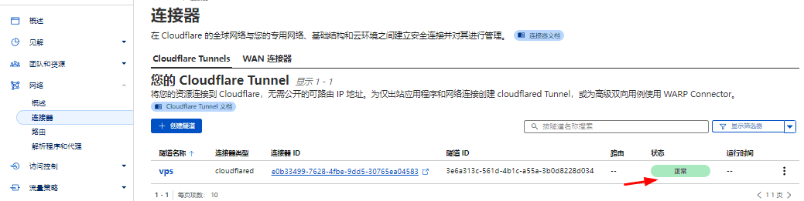 


### 5.6 客户端测试

客户端粘贴订阅地址，把服务器主机改为隧道节点  **node1.xxx.xxx.org**

端口：443

传输层加密：tls

访问油管成功：

 


## 6.被封IP怎么连接vps

### 6.1 前提条件

如果你的vps服务器IP地址被封，大陆没法直接  ssh 连接管理

你需要能够翻出去，clash , v2rayN , 寻找机场等等各种能让你出去的方式，海外云服务器也可以

或者配置本教程 **5步骤** 的隧道技术节点，终极防失联，使用它来代理 ssh 连接管理被墙的 vps **[强烈推荐]**

或者不跑路机场：[链接直达](https://mitce.net/aff.php?aff=26603)

海外云服务器不用多说，连接它直接就能用它  ssh  跳转连接你被墙的vps

**重点说一说如何：通过代理ssh连接被墙vps**

我们用 [雷电模拟器](https://www.ldmnq.com) 安装任意代理客户端，打开代理clash , v2rayN，[NekoBox下载](https://github.com/MatsuriDayo/NekoBoxForAndroid/releases/tag/1.4.0)，并使用 **[every-proxy](https://apkcombo.com/zh/every-proxy/com.gorillasoftware.everyproxy/download/phone-14.2-apk)** 软件，开放 `http` 代理端口 `8080` 以及 `socks5` 代理端口 `1080`

至此，准备工作结束，接着看下一步............

### 6.2 一般情况

🌀**一般http协议代理用途**

```bash
#临时配置环境变量
╰─ export http_proxy='http://192.168.1.150:8080'
╰─ export https_proxy='http://192.168.1.150:8080'
╰─ export all_proxy='socks5://192.168.1.150:1080'
╰─ export no_proxy='localhost,127.0.0.1,192.168.44.0/24,192.168.1.0/24'

#永久配置环境变量
╰─ vim ~/.zshrc   #shel是zsh的配置这个文件
╰─ vim ~/.bashrc  #shel是bash的配置这个文件

#添加如下4行到文件最后
export http_proxy='http://192.168.1.150:8080'
export https_proxy='http://192.168.1.150:8080'
export all_proxy='socks5://192.168.1.150:1080'
export no_proxy='localhost,127.0.0.1,192.168.44.0/24,192.168.1.0/24'

#或者创建函数，一劳永逸
╰─ vim ~/.zshrc
╰─ vim ~/.bashrc
=================================================================================
# set proxy on
proxy_on() {

    export http_proxy="http://192.168.1.150:8080"
    export https_proxy="http://192.168.1.150:8080"
    export all_proxy="socks5://192.168.1.150:1080"
    export no_proxy="localhost,127.0.0.1,192.168.44.0/24,192.168.1.0/24"
    echo "proxy on!"
}

# set proxy off
proxy_off() {

    unset http_proxy
    unset https_proxy
    unset all_proxy
    unset no_proxy
    echo "proxy off!"
}
=================================================================================

#生效配置
╰─ source ~/.zshrc
╰─ source ~/.bashrc

#开启代理
proxy_on

#关闭代理
proxy_off

#测试访问谷歌
╰─ curl google.com
<HTML><HEAD><meta http-equiv="content-type" content="text/html;charset=utf-8">
<TITLE>301 Moved</TITLE></HEAD><BODY>
<H1>301 Moved</H1>
The document has moved
<A HREF="http://www.google.com/">here</A>.
</BODY></HTML>
```

### 6.3 特殊情况

🌀**特殊用途**

**ssh能不能通过代理连接被墙的IP地址呢？**

可以，但**单纯设置环境变量（如 `all_proxy`）对 SSH 是无效的**。

这是因为 SSH 客户端（`ssh` 命令）设计得非常底层且追求安全，它默认**不会读取** `all_proxy` 或 `http_proxy` 环境变量。要让 SSH 走代理，你需要通过 **`ProxyCommand`** 或者 **`ProxyJump`** 来实现。

------

**方法一：使用 `nc` (Netcat) 或 `ncat` (最推荐)**

这是最通用的方法。通过 `ProxyCommand` 告诉 SSH：不要自己去连目标 IP，而是通过一个代理通道把流量传过去。

1. 如果你的代理是 SOCKS5：

```bash
#安装ncat
yum provides nc
yum install nmap-ncat

#通过代理ssh连接
ssh -o "ProxyCommand=ncat --proxy-type socks5 --proxy 192.168.1.150:1080 %h %p" root@你的被墙IP
```

- `--proxy-type`：指定使用 SOCKS5 协议。
- `--proxy 192.168.1.150:1080`：你的本地代理地址（模拟器地址）。
- `%h %p`：自动替换为目标主机名和端口。

2. 如果你的代理是 HTTP：

```bash
#安装ncat
yum provides nc
yum install nmap-ncat

#通过代理ssh连接
ssh -o "ProxyCommand=ncat --proxy-type http --proxy 192.168.1.150:8080 %h %p" root@你的被墙IP
```

- `--proxy-type`：指定使用 HTTP 协议。
- `--proxy 192.168.1.150:8080`：你的本地代理地址（模拟器地址）。
- `%h %p`：自动替换为目标主机名和端口。

------

**方法二：永久配置（一劳永逸）**

如果你不想每次都输入那么长的命令，可以修改你本地的 SSH 配置文件 `~/.ssh/config`：

1. 如果你的代理是 SOCKS5：

```bash
Host my-server
    HostName 1.2.3.4  # 被墙的 IP
    User root
    Port 22
    # 只要访问这个 Host，就自动走代理
    ProxyCommand ncat --proxy-type socks5 --proxy 192.168.1.150:1080 %h %p
```

设置后，你只需要执行：`ssh my-server` 即可。

2. 如果你的代理是 HTTP：

```bash
Host my-server
    HostName 1.2.3.4  # 被墙的 IP
    User root
    Port 22
    # 只要访问这个 Host，就自动走代理
    ProxyCommand ncat --proxy-type http --proxy 192.168.1.150:8080 %h %p
```

设置后，你只需要执行：`ssh my-server` 即可。

------

**方法三：使用 `ProxyJump` (如果你有另一台没被墙的服务器，比如海外云服务器)**

如果你没有本地代理工具，但有一台可以正常连接的“跳板机”（B服务器），可以通过它中转连接被墙的 A 服务器：

```bash
ssh -J userB@跳板机IP userA@被墙IP
```

- **原理**：流量先加密发送到跳板机，再由跳板机连接目标 IP。

------

常见问题排查

| **现象**               | **原因**           | **解决方法**                                                 |
| ---------------------- | ------------------ | ------------------------------------------------------------ |
| **找不到 nc 命令**     | 系统没装 `netcat`  | 安装：`sudo apt install netcat-openbsd` 或 `yum install nmap-ncat` |
| **Connection refused** | 代理没开启或端口错 | 检查 `ss -tunpl` 确认 1080 端口是否在监听。                  |
| **nc 不支持 -X 参数**  | 用的是传统 nc      | 尝试使用 `ncat` (nmap 自带) 替代。                           |

------

为什么 `all_proxy` 没用？

因为 SSH 使用的是自定义的加密二进制流，而 `all_proxy` 主要是为 HTTP/HTTPS 应用程序准备的。SSH 需要的是一个能透明转发原始 TCP 流的工具（如 `nc` 或 `ncat`）。

**你目前电脑上运行的代理工具（如 Clash 或 V2Ray）提供的本地端口是 SOCKS5 还是 HTTP？** 告诉我端口类型，我可以给你提供最准确的配置。
