## 1.准备

RackNerd便宜服务器1台

- 成立于 2017 年，美国老牌服务器供应商
- 优先选择洛杉矶Los Angeles DC02、圣何塞San Jose
- 终身续费同价
- 3天内免费更换1次IP，不用担心失联
- 终身免费流量翻倍：只需要简单的福利回帖操作，就能翻倍
- 支付方式灵活，支持 PayPal、信用卡、支付宝
- 7x24小时客服，支持中文


| CPU  | 内存 | SSD硬盘 |     月流量带宽      |    优惠价格    |                           点击购买                           |
| :--: | :--: | :-----: | :-----------------: | :------------: | :----------------------------------------------------------: |
| 1 核 | 1 G  |  20 G   | 3 TB流量/月 @1Gbps  | **$21.99/年**  | **[官网链接](https://my.racknerd.com/aff.php?aff=17562&pid=952)** |
| 2 核 | 2 G  |  35 G   | 5 TB流量/月 @1Gbps  | **$35.99/年**  | **[官网链接](https://my.racknerd.com/aff.php?aff=17562&pid=953)** |
| 3 核 | 4 G  |  60 G   | 7 TB流量/月 @1Gbps  | **$59.99/年**  | **[官网链接](https://my.racknerd.com/aff.php?aff=17562&pid=954)** |
| 6 核 | 6 G  |  100 G  | 12 TB流量/月 @1Gbps | **$89.99/年**  | **[官网链接](https://my.racknerd.com/aff.php?aff=17562&pid=955)** |
| 7 核 | 8 G  |  150 G  | 20 TB流量/月 @1Gbps | **$119.99/年** | **[官网链接](https://my.racknerd.com/aff.php?aff=17562&pid=956)** |


IP地址纯净度查询：https://www.ping0.cc/


## 2.流量翻倍教学

### 01-LET论坛注册账号

官方地址：https://lowendtalk.com/
注册理由what do you want to join？：

```bash
Hello, I would like to register for the forum and purchase a cost-effective VPS. Thank you！
```

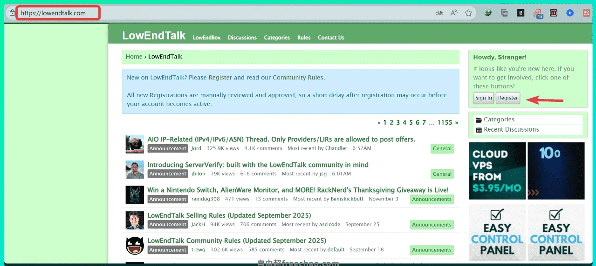 

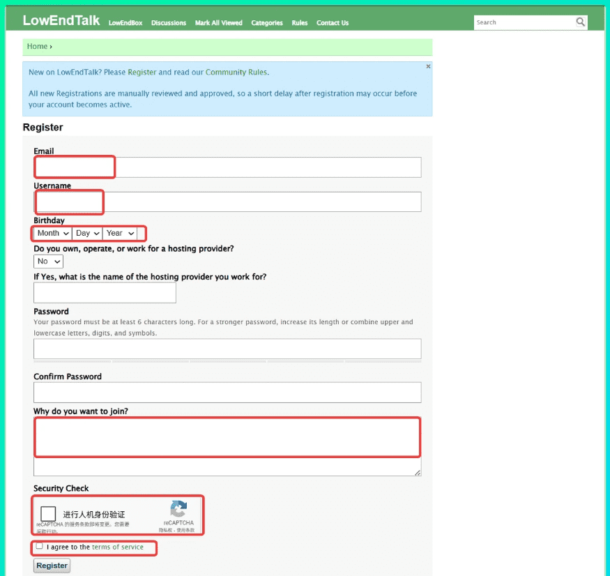 

如果没有使用魔法，注册信息填写完之后会报验证错误：the captcha was not completed correctly.please try again.

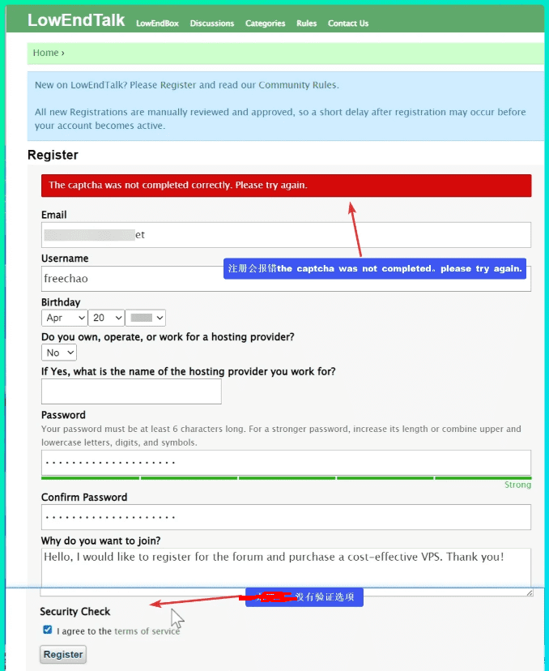 

注册信息提交之后，邮箱会收到一封验证邮件

 

 

确认邮箱之后，大概过了20分钟左右才正式被激活。

 


### 02-获取RackNerd订单号

登录RackNerd后台，点击【view email log】可以看到之前购买服务器发送的发票邮件

https://my.racknerd.com/index.php?rp=/login

找到对应的服务器，复制invoice

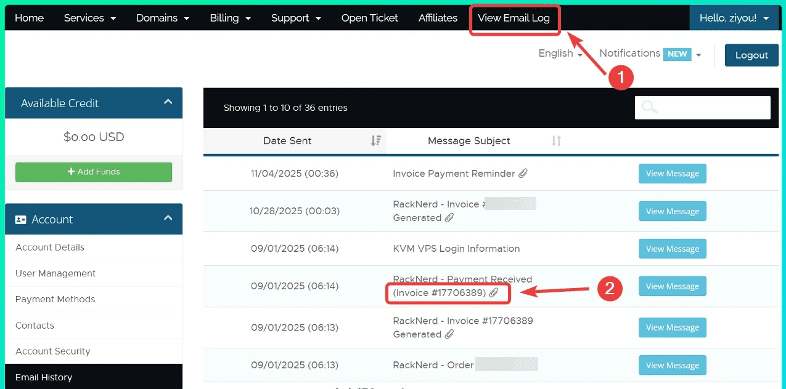 


### 03-LET论坛回帖申请

RackNerd流量翻倍帖子(任意可以）：

https://lowendtalk.com/discussion/211640/trending-now-racknerd-s-black-friday-new-deals-new-locations-new-hardware-100-s-of-giveaways#latest

如果注册账号还没有被激活，会看到以下页面，无法进行发帖或回复帖子

 

注册账号激活之后，再次打开申请帖子，拉到最底部回复帖子模板：

把12345678，换成你的订单号

```
Hello, I would like to double my bandwidth.
Invoice #12345678
Thanks!
```

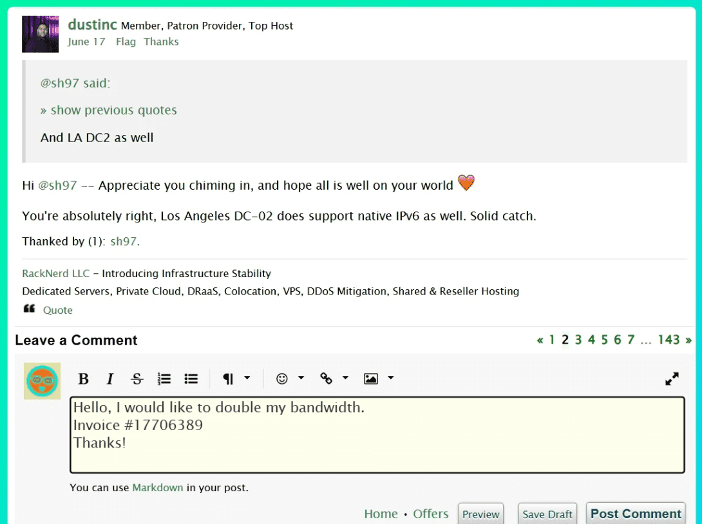 

正常大概3个工作日内，如果官方dustinc回复如下信息，说明流量翻倍成功。

实测11月4日提交，11月17日回复翻倍成功！可能这段时间促销旺季比较忙。

登录LET论坛，在消息提醒里面可以看到回复信息

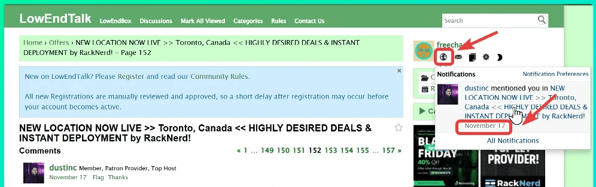 

点开之后就会跳转到回复的具体内容，类似这样的就算翻倍成功啦！

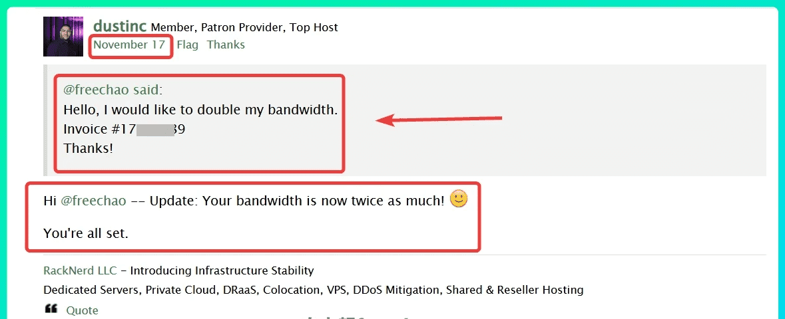 

### 04-确认是否翻倍？

登录RackNerd后台，点开【Services】，打开翻倍的服务器

翻倍前流量

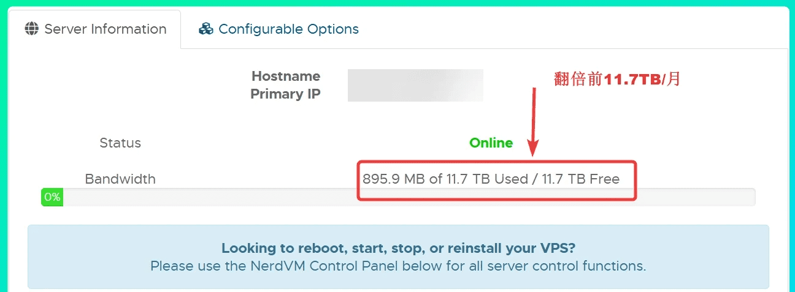 

翻倍后流量

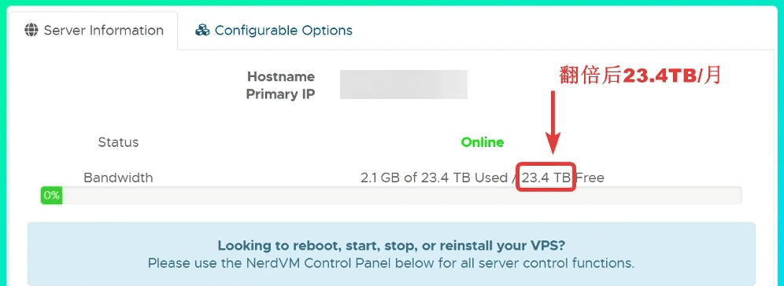 


## 3.搭建vpn（弃用脚本方式）

SSH工具连接服务器

- 名称：任意自定义
- 主机：服务器的ip地址
- 端口：基本都是22
- 用户名：root
- 密码：服务器的root密码

### 3.1 系统升级组件安装

```bash
apt update -y && apt install -y curl && apt install -y socat
```

### 3.2 Hysteria2 一键安装脚本（开源安全）

```bash
wget -N --no-check-certificate https://raw.githubusercontent.com/flame1ce/hysteria2-install/main/hysteria2-install-main/hy2/hysteria.sh && bash hysteria.sh
```

**输入“1”：安装 Hysteria 2**

```bash
#############################################################
#                  Hysteria 2 一键安装脚本                  #
#############################################################

 1. 安装 Hysteria 2
 2. 卸载 Hysteria 2
 ------------------------------------------------------------
 3. 关闭、开启、重启 Hysteria 2
 4. 修改 Hysteria 2 配置
 5. 显示 Hysteria 2 配置文件
 ------------------------------------------------------------
 0. 退出脚本

请输入选项 [0-5]: 1
```

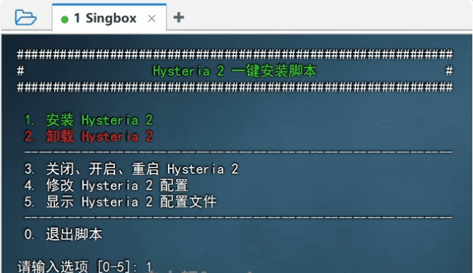 

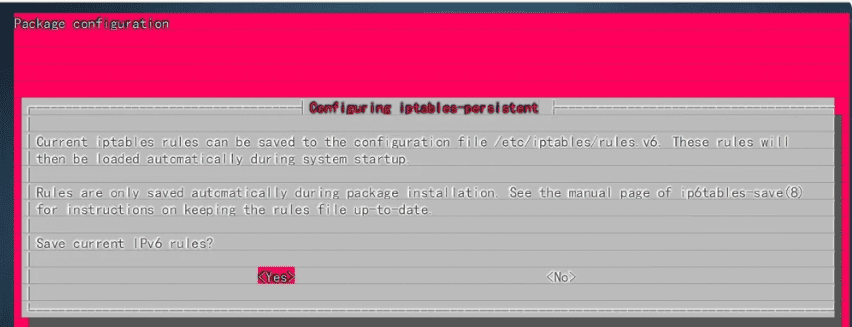 

### 3.3 配置Hysteria 2协议

⦁ 输入“1”：必应自签证书 （默认）
⦁ 回车：设置 Hysteria 2 端口为随机端口
⦁ 输入“1”：单端口 （默认）
⦁ 回车：设置 Hysteria 2 密码为随机密码
⦁ 设置Hysteria 2 的伪装网站地址：输入“www.bing.com”

```bash
aws.com
amd.com
bing.com
go.microsoft.com
snap.licdn.com
devblogs.microsoft.com
cdn.bizibly.com
www.apple.com
ts1.tc.mm.bing.net
fpinit.itunes.apple.com
catalog.gamepass.com
gray-config-prod.api.arc-cdn.net
apps.mzstatic.com
tag.demandbase.com
r.bing.com
tag-logger.demandbase.com
cdn-dynmedia-1.microsoft.com
services.digitaleast.mobi
gray.video-player.arcpublishing.com
azure.microsoft.com
beacon.gtv-pub.com
```

日志

```bash
Hysteria 2 安装成功！
Hysteria 2 协议证书申请方式如下：

 1. 必应自签证书 （默认）
 2. Acme 脚本自动申请
 3. 自定义证书路径

请输入选项 [1-3]: 1
将使用必应自签证书作为 Hysteria 2 的节点证书
设置 Hysteria 2 端口 [1-65535]（回车则随机分配端口）：
将在 Hysteria 2 节点使用的端口是：11075
Hysteria 2 端口使用模式如下：

 1. 单端口 （默认）
 2. 端口跳跃

请输入选项 [1-2]: 1
将继续使用单端口模式
设置 Hysteria 2 密码（回车跳过为随机字符）：
使用在 Hysteria 2 节点的密码为：db53d5f1
请输入 Hysteria 2 的伪装网站地址 （去除https://） [默认首尔大学]：www.bing.com
使用在 Hysteria 2 节点的伪装网站为：www.bing.com
```

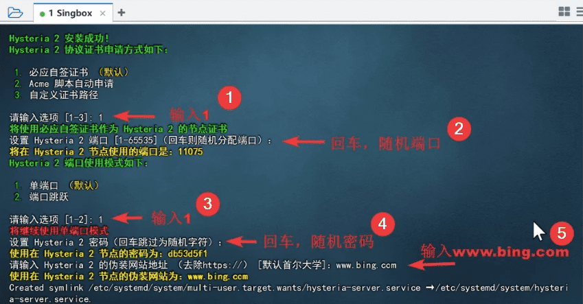 

### 3.4 保存Hysteria 2协议节点链接

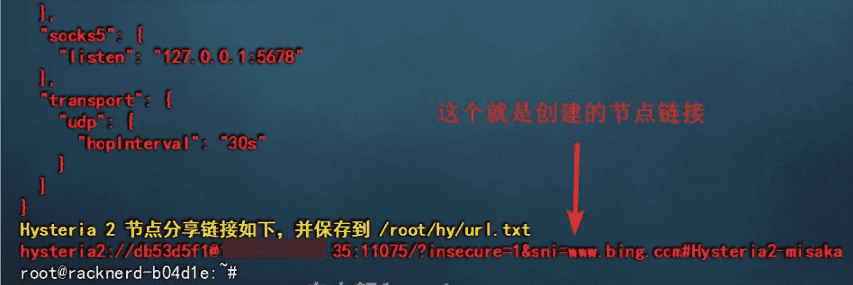 


### 3.5 客户端配置

- Windows（v2rayN）：https://github.com/2dust/v2rayN/releases （下载v2rayN-windows-64-SelfContained.zip版）
- Android（v2rayNG）：https://github.com/2dust/v2rayNG/releases
- Mac（v2rayN）：https://github.com/2dust/v2rayN/releases
- IOS（shadowrocket）：https://apps.apple.com/app/shadowrocket/id932747118

扫描二维码、或复制粘贴链接导入客户端


### 3.6 如何查看更改配置

还是输入安装代码，可以【修改配置】、【显示配置文件】等

```bash
wget -N --no-check-certificate https://raw.githubusercontent.com/flame1ce/hysteria2-install/main/hysteria2-install-main/hy2/hysteria.sh && bash hysteria.sh
```

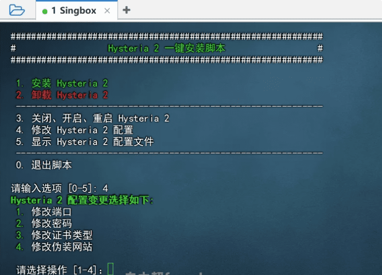 

郑重声明：请合理使用科学上网，用于学习、科研、外贸等，严格遵守当地相关规定！


## 4.搭建vpn（推荐s-ui面板方式）

### 4.1 卸载旧版vpn

还是输入安装代码，可以卸载等

```bash
wget -N --no-check-certificate https://raw.githubusercontent.com/flame1ce/hysteria2-install/main/hysteria2-install-main/hy2/hysteria.sh && bash hysteria.sh
```

### 4.2 绑定域名防墙

登录：https://dash.cloudflare.com/

域名获取：

免费白嫖永久域名：https://www.youtube.com/watch?v=aZGlGjn4OHM

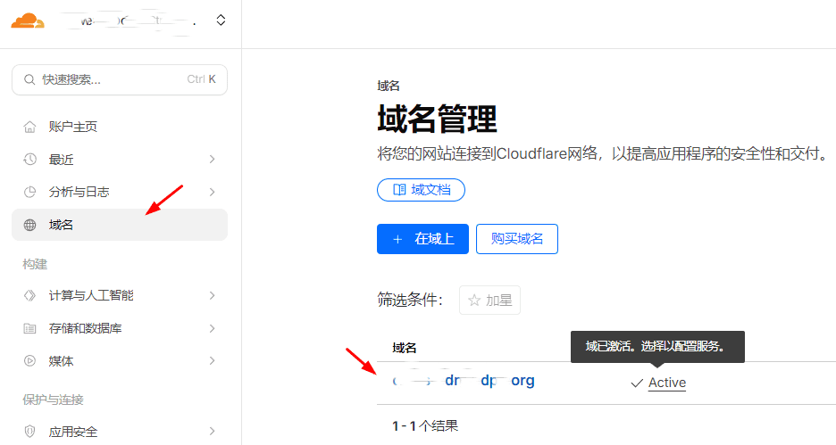 

添加DNS解析，到你的vps节点

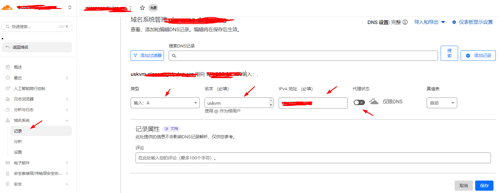 


### 4.3 一键安装与卸载

[官方文档](https://v2.hysteria.network/zh/docs/getting-started/Server-Installation-Script/)

安装；https://github.com/xiaochaib/chaiwiki/wiki/

```bash
#安装git
yum install git bash-completion vim -y
yum update -y && yum install -y curl socat wget

#关闭防火墙
[root@racknerd-0566bb5 ~/acme]# systemctl status nftables.service

[root@racknerd-0566bb5 ~/acme]# systemctl status iptables.service

[root@racknerd-0566bb5 ~/acme]# systemctl status firewalld.service
[root@racknerd-0566bb5 ~/acme]# systemctl disable firewalld.service --now
[root@racknerd-0566bb5 ~/acme]# systemctl status firewalld.service

#安装S-UI
#地址：https://github.com/alireza0/s-ui
bash <(curl -Ls https://raw.githubusercontent.com/alireza0/s-ui/master/install.sh)

===================================
###############################################
username:fNrrlphy
password:qxAGy240
###############################################
if you forgot your login info,you can type s-ui for configuration menu
reset admin credentials success
First admin credentials:
        Username:        fNrrlphy
        Password:        qxAGy240
Created symlink /etc/systemd/system/multi-user.target.wants/s-ui.service → /etc/systemd/system/s-ui.service.
s-ui vv1.3.7 installation finished, it is up and running now...
You may access the Panel with following URL(s):
Local address:
http://your_ip:2095/app/

Global address:
http://your_ip:2095/app/


The OS release is: almalinux
S-UI Control Menu Usage
------------------------------------------
SUBCOMMANDS:
s-ui              - Admin Management Script
s-ui start        - Start s-ui
s-ui stop         - Stop s-ui
s-ui restart      - Restart s-ui
s-ui status       - Current Status of s-ui
s-ui enable       - Enable Autostart on OS Startup
s-ui disable      - Disable Autostart on OS Startup
s-ui log          - Check s-ui Logs
s-ui update       - Update
s-ui install      - Install
s-ui uninstall    - Uninstall
s-ui help         - Control Menu Usage
------------------------------------------
```

显示三行红字, 代表安装成功

设置开机自启

```bash
[root@racknerd-0566bb5 ~]# systemctl daemon-reload
[root@racknerd-0566bb5 ~]# systemctl enable s-ui
[root@racknerd-0566bb5 ~]# systemctl restart s-ui
[root@racknerd-0566bb5 ~]# systemctl status s-ui.service
● h-ui.service - h-ui Service
     Loaded: loaded (/etc/systemd/system/h-ui.service; enabled; preset: disabled)
     Active: active (running) since Tue 2025-12-30 23:08:46 CST; 17s ago
   Main PID: 58208 (h-ui)
      Tasks: 4 (limit: 5928)
     Memory: 40.0M
        CPU: 380ms
     CGroup: /system.slice/h-ui.service
             └─58208 /usr/local/h-ui/h-ui

Dec 30 23:08:47 racknerd-0566bb5 h-ui[58208]: [GIN-debug] POST   /hui/hysteria2/hysteria2Kick --> h-ui/controller.Hysteria2Kick (8 handlers)
Dec 30 23:08:47 racknerd-0566bb5 h-ui[58208]: [GIN-debug] POST   /hui/hysteria2/hysteria2ChangeVersion --> h-ui/controller.Hysteria2ChangeVersion (8 handlers)
```

挑选SNI伪装域名（任选一个）

```
如发现节点不能使用，或延迟显示-1，以下域名请随机挑选用于SNI，直到正常使用即可，或者直接照抄视频中一模一样的域名填写，确保可用
aws.com
bing.com
snap.licdn.com
devblogs.microsoft.com
cdn.bizibly.com
www.apple.com
ts1.tc.mm.bing.net
fpinit.itunes.apple.com
go.microsoft.com
catalog.gamepass.com
gray-config-prod.api.arc-cdn.net
apps.mzstatic.com
tag.demandbase.com
r.bing.com
tag-logger.demandbase.com
cdn-dynmedia-1.microsoft.com
services.digitaleast.mobi
gray.video-player.arcpublishing.com
azure.microsoft.com
beacon.gtv-pub.com
amd.com
```

**BBR加速**

输入s-ui运行，输入18运行，输入1运行，开启BBR加速，显著提升速度

```
s-ui state: Running
Start s-ui automatically: Yes

Please enter your selection [0-20]: 18
        1. Enable BBR
        2. Disable BBR
        0. Back to Main Menu
Choose an option: 1
Last metadata expiration check: 1:19:50 ago on Tue 30 Dec 2025 11:24:05 PM CST.
Error:
 Problem: cannot install both initscripts-10.11.8-4.el9.x86_64 from baseos and initscripts-10.11.4-1.el9.x86_64 from @System
  - package network-scripts-10.11.4-1.el9.x86_64 from @System requires initscripts(x86-64) = 10.11.4-1.el9, but none of the providers can be installed
  - cannot install the best update candidate for package initscripts-10.11.4-1.el9.x86_64
  - problem with installed package network-scripts-10.11.4-1.el9.x86_64
(try to add '--allowerasing' to command line to replace conflicting packages or '--skip-broken' to skip uninstallable packages or '--nobest' to use not only best candidate packages)
net.core.default_qdisc=fq
net.ipv4.tcp_congestion_control=bbr
net.core.default_qdisc = fq
net.ipv4.tcp_congestion_control = bbr
BBR has been enabled successfully.
```

卸载

```bash
sudo -i

systemctl disable s-ui  --now

rm -f /etc/systemd/system/sing-box.service
systemctl daemon-reload

rm -fr /usr/local/s-ui
rm /usr/bin/s-ui
```

### 4.4 服务端配置

http://your_ip:2095/app/

https://www.youtube.com/watch?v=6l01iAgKglY&t=10s

修改管理员账号密码

账号：你懂得.......

密码：你懂得.........

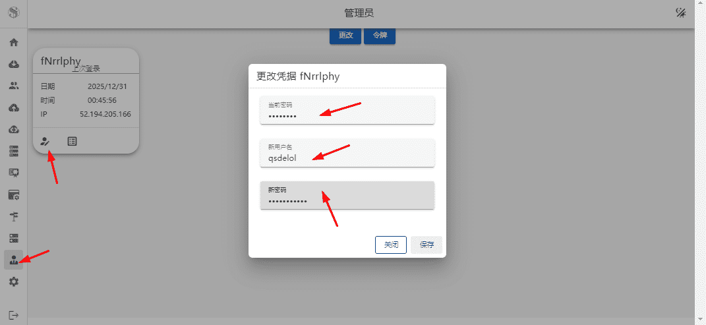 

添加tls证书路径

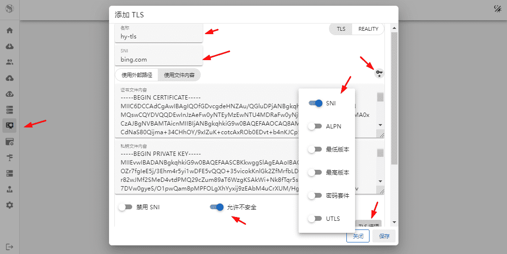 

配置入站

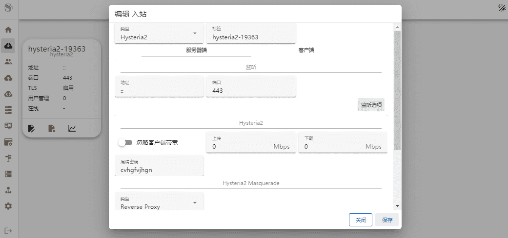 

 配置用户

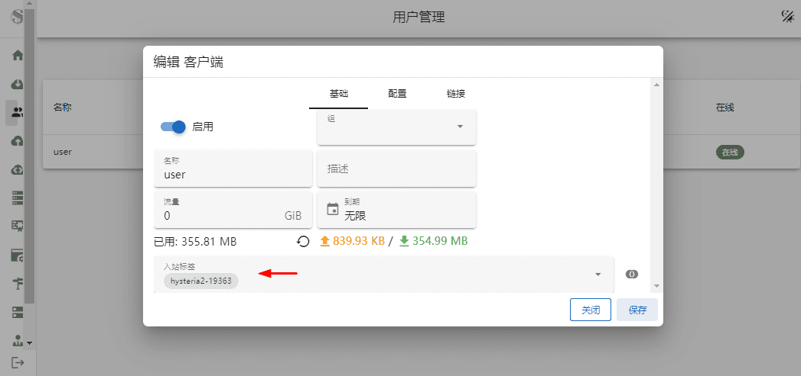 


### 4.5 开放端口

```bash
#如果上方失败，开放端口试试
➜ sudo nft add rule inet filter INPUT udp dport 443 accept
➜ sudo nft add rule inet filter INPUT tcp dport 2095 accept
➜ sudo nft list ruleset
table inet hui_porthopping {
        chain prerouting {
                type nat hook prerouting priority dstnat; policy accept;
        }
}
table inet filter {
        chain INPUT {
                type filter hook input priority filter; policy drop;
                tcp dport 22 accept
                iifname "lo" accept
                icmp type echo-request accept
                ct state established,related accept
                udp dport 443 accept
                tcp dport 2095 accept
        }

        chain FORWARD {
                type filter hook forward priority filter; policy accept;
        }

        chain OUTPUT {
                type filter hook output priority filter; policy accept;
                oifname "lo" accept
                ct state established,related accept
        }
}

#保存配置
➜ sudo nft list ruleset > /etc/nftables/full.nft
➜ vim /etc/sysconfig/nftables.conf
➜ cat /etc/sysconfig/nftables.conf
include "/etc/nftables/full.nft"

#重启防火墙
➜ systemctl restart nftables.service

#查看状态
➜ systemctl status nftables.service

#成功启动
➜ ss -tunpl
Netid       State        Recv-Q       Send-Q              Local Address:Port               Peer Address:Port       Process
udp         UNCONN       0            0                      127.0.0.54:53                      0.0.0.0:*           users:(("systemd-resolve",pid=433,fd=16))
udp         UNCONN       0            0                   127.0.0.53%lo:53                      0.0.0.0:*           users:(("systemd-resolve",pid=433,fd=14))
udp         UNCONN       0            0                               *:443                           *:*           users:(("hysteria",pid=4460,fd=3))
tcp         LISTEN       0            4096                127.0.0.53%lo:53                      0.0.0.0:*           users:(("systemd-resolve",pid=433,fd=15))
tcp         LISTEN       0            4096                   127.0.0.54:53                      0.0.0.0:*           users:(("systemd-resolve",pid=433,fd=17))
tcp         LISTEN       0            4096                            *:22                            *:*           users:(("sshd",pid=755,fd=3),("systemd",pid=1,fd=199))

```


### 4.6 客户端 配置

```bash
#电脑配置
server: your.domain.net:443 #你的vps的已经解析的域名
auth: Se7RAuFZ8Lzg #密码，需要与服务端一样

bandwidth:
  up: 20 mbps #你家宽带的上传速度
  down: 100 mbps #下载速度
  
tls:
  sni: your.domain.net #你的域名，为空将和server一致，通常留空
  insecure: false #使用自签时需要改成true

socks5:
  listen: 127.0.0.1:1080

http:
  listen: 127.0.0.1:8080
  
#手机配置
================================================
服务器地址: 192.3.85.247 --你的vps地址
服务器端口: 443  --默认
密码：Se7RAuFZ8Lzg  --密码，需要与服务端一样
宽带速率设置：500M  --你家宽带的上传下载速度
传输层安全tls：
SNI：your.domain.net  --你的域名，为空将和server一致，通常留空
跳过证书：false  --仅自签证书时改为true
```

**安卓/Android：**[NekoBox下载](https://github.com/MatsuriDayo/NekoBoxForAndroid/releases/tag/1.4.0)

扫码或复制链接，粘贴导入

开启代理

**cloudflare --域名--dns系统--解析--把代理开启--小云朵亮起来**


## 5.给面板和节点隧道访问

**作用：防止被扫描，封IP**

视频教程：https://www.youtube.com/watch?v=VtVCupq-Gsw

教程：https://amclubss.com/argo

你的 VPS IP 被封？别慌！教你用 Cloudflare Argo Tunnel 一键恢复被封的 VPS 节点。

**仅支持 VLESS / Trojan / Vmess / WebSocket / gRPC / TCP 多协议**


### 5.1 创建s-ui节点

创建无tls的节点，如 VLESS / Trojan / Vmess 等等协议

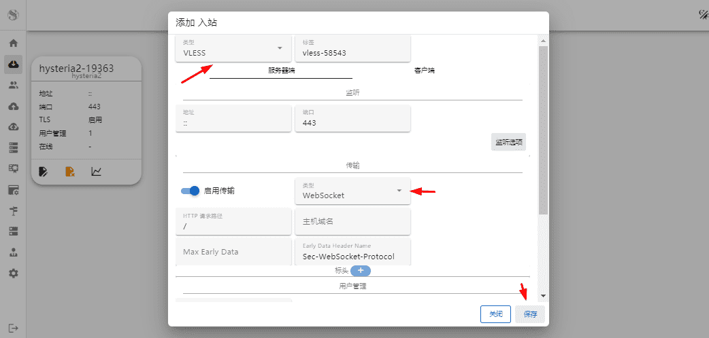 

配置用户，把节点加入

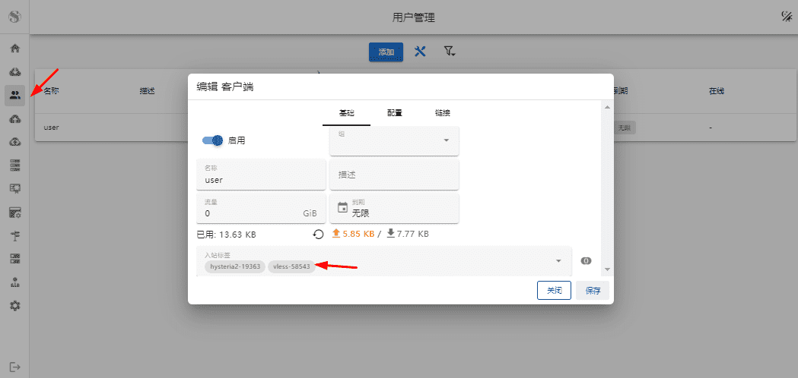 


### 5.2 端口知识

**s-ui配置Cloudflare的CDN和TLS证书**
**面板加CDN、节点加CDN配置Cloudflare的15年证书使用，或隧道代理都需要遵守，使用以下标准端口**

**cloudflare标准 端口 知识**

> - 80系端口(HTTP)：80，8080，8880，2052，2082，2086，2095
> - 443系端口(HTTPS)：443，2053，2083，2087，2096，8443

修改s-ui面板配置，支持正常端口

```bash
[root@racknerd-0566bb5 ~]# s-ui
————————————————————————————————
  8. Reset Panel Settings
  9. Set Panel settings
  10. View Panel Settings
————————————————————————————————
Please enter your selection [0-20]: 9
Enter the panel port (leave blank for existing/default value):
2095  --修改面板访问端口
Enter the panel path (leave blank for existing/default value):
app   --修改模板路径
Enter the subscription port (leave blank for existing/default value):
2096  --修改订阅地址端口
Enter the subscription path (leave blank for existing/default value):
sub   --修改订阅路径
Initializing, please wait...
set port success
set path success
set sub port success
set sub path success
Current panel settings:
        Panel port:      2095
        Panel path:      /app/

Current subscription settings:
        Sub port:        2096
        Sub path:        /sub/
        
#重启面板生效
————————————————————————————————
  11. S-UI Start
  12. S-UI Stop
  13. S-UI Restart
  14. S-UI Check State
  15. S-UI Check Logs
  16. S-UI Enable Autostart
  17. S-UI Disable Autostart
————————————————————————————————
  18. Enable or Disable BBR
  19. SSL Certificate Management
  20. Cloudflare SSL Certificate
————————————————————————————————

s-ui state: Running
Start s-ui automatically: Yes

Please enter your selection [0-20]: 13
```


### 5.3 关闭端口

```bash
#关闭所有暴露端口
[root@racknerd-0566bb5 ~]# vim /etc/nftables/full.nft
[root@racknerd-0566bb5 ~]# cat /etc/nftables/full.nft
table inet filter {
        chain INPUT {
                type filter hook input priority filter; policy drop;
                tcp dport 22 accept
                iifname "lo" accept
                icmp type echo-request accept
                ct state established,related accept
                udp dport 443 accept
        }

        chain FORWARD {
                type filter hook forward priority filter; policy accept;
        }

        chain OUTPUT {
                type filter hook output priority filter; policy accept;
                oifname "lo" accept
                ct state established,related accept
        }
}
table inet hui_porthopping {
        chain prerouting {
                type nat hook prerouting priority dstnat; policy accept;
        }
}

#生效配置
[root@racknerd-0566bb5 ~]# systemctl restart nftables.service
[root@racknerd-0566bb5 ~]# nft list ruleset
table inet filter {
        chain INPUT {
                type filter hook input priority filter; policy drop;
                tcp dport 22 accept
                iifname "lo" accept
                icmp type echo-request accept
                ct state established,related accept
                udp dport 443 accept
        }

        chain FORWARD {
                type filter hook forward priority filter; policy accept;
        }

        chain OUTPUT {
                type filter hook output priority filter; policy accept;
                oifname "lo" accept
                ct state established,related accept
        }
}
table inet hui_porthopping {
        chain prerouting {
                type nat hook prerouting priority dstnat; policy accept;
        }
}

#查看端口
[root@racknerd-0566bb5 ~]# ss -tunpl
Netid        State         Recv-Q        Send-Q               Local Address:Port                Peer Address:Port        Process
udp          UNCONN        0             0                        127.0.0.1:323                      0.0.0.0:*            users:(("chronyd",pid=43595,fd=5))
udp          UNCONN        0             0                            [::1]:323                         [::]:*            users:(("chronyd",pid=43595,fd=6))
udp          UNCONN        0             0                                *:443                            *:*            users:(("sui",pid=75637,fd=12))
tcp          LISTEN        0             128                        0.0.0.0:22                       0.0.0.0:*            users:(("sshd",pid=28841,fd=3))
tcp          LISTEN        0             4096                             *:2095                           *:*            users:(("sui",pid=75637,fd=7))
tcp          LISTEN        0             4096                             *:2096                           *:*            users:(("sui",pid=75637,fd=8))
tcp          LISTEN        0             128                           [::]:22                          [::]:*            users:(("sshd",pid=28841,fd=4))
```

此时访问：http://your_global_ip:2095/app/ 是不能访问面板的

### 5.4 ssh隧道访问面板

Windows终端走ssh端口转发

**SSH 端口转发（SSH Port Forwarding）**，通常也被称为 SSH 隧道，是一种利用 SSH 协议将网络数据包封装在加密通道中进行传输的技术。它不仅能保障数据安全，还能帮助我们访问原本受限的网络资源。
根据数据传输方向的不同，主要分为以下三种模式：

1. **本地端口转发 (Local Port Forwarding)**
    场景： 你在家里，想访问公司内网的一台数据库服务器，但数据库端口不对外开放，只有 SSH 服务器可以从外部访问。

  >  * 原理： 在本地机器上监听一个端口，将发送到该端口的数据通过 SSH 隧道转发到远程主机的某个端口。
  >  * 命令格式：
  >    ssh -L [本地地址:]本地端口:目标主机:目标端口 SSH用户@SSH服务器
  >  * 示例：
  >    ssh -L 8080:192.168.1.50:3306 user@ssh-server.com
  >    这表示：当你访问本地的 localhost:8080 时，流量会通过 ssh-server.com 转发到内网 192.168.1.50 的 3306 端口。
2. **远程端口转发 (Remote Port Forwarding)**
    场景： 你在公司内部开发了一个网页，想让家里的朋友看看，但公司没有公网 IP。

  >  * 原理： 在远程 SSH 服务器上监听一个端口，将发送到该端口的数据通过 SSH 隧道转发回本地机器的某个端口。
  >  * 命令格式：
  >    ssh -R [远程地址:]远程端口:目标主机:目标端口 SSH用户@SSH服务器
  >  * 示例：
  >    ssh -R 9000:localhost:80 user@public-server.com
  >    这表示：任何人访问 public-server.com:9000，流量都会被转发到你本地机器的 80 端口。
3. **动态端口转发 (Dynamic Port Forwarding)**
    场景： 你需要一个通用的代理服务器，想通过 SSH 服务器访问多个不同的外部网站，而不必为每个目标都设置转发。

  >  * 原理： SSH 会启动一个 SOCKS 代理服务器。流量不再固定转发到某个特定目标，而是根据应用层的需求动态决定去向。
  >  * 命令格式：
  >    ssh -D 本地端口 SSH用户@SSH服务器
  >  * 示例：
  >    ssh -D 1080 user@ssh-server.com
  >    这表示：在本地开启了 SOCKS5 代理。你在浏览器设置代理为 localhost:1080 后，所有上网流量都会经过 SSH 服务器代为发出。

常用参数说明

| 参数         | 说明                                             |
| ------------ | ------------------------------------------------ |
| -N           | 不执行远程命令（仅用于转发端口，不进入 Shell）。 |
| -f           | 后台运行 SSH 会话。                              |
| -L / -R / -D | 分别对应本地、远程、动态转发。                   |
| -C           | 压缩数据，提高传输效率。                         |

💡 提示
如果你是在 Linux 或 macOS 上操作，直接在终端输入命令即可；

如果是 Windows，推荐使用 PowerShell 或 PuTTY（PuTTY 在 Connection -> SSH -> Tunnels 中设置）。

你想针对某个具体的应用场景（如数据库连接或绕过防火墙）获取更详细的配置步骤吗？

```bash
#开启ssh隧道，替换your-vps-ip，为你的vps服务器IP地址
PS C:\Users\Fizz\Desktop> ssh -N -L 8080:localhost:2095 root@your-vps-ip
```

访问 ：http://127.0.0.1:8080/app/ 即可开启s-ui面板


**🌀重要说明：目标地址**

在 SSH 本地端口转发命令 `-L 127.0.0.1:8080:localhost:2095` 中，**“目标地址”**（即中间的 `localhost:2095` 部分）是最容易产生误解的地方。

理解它的核心秘诀是：**这个地址不是由你的电脑视角解析的，而是由远程服务器视角解析的。**

------

**1. 视角转换：谁在看这个地址？**

当你建立 SSH 连接后，你的电脑和远程服务器之间已经拉起了一根加密的“管道”。

- **起点**：你本地电脑的 SSH 客户端。
- **终点**：远程服务器（1.2.3.4）上的 SSH 服务端。

当你访问本地 `8080` 端口时，流量顺着管道传到了远程服务器。此时，远程服务器会站出来问：“既然我收到数据了，你要我把它转交给谁？”

**“目标地址”就是你给远程服务器下的指令。**

------

**2. “目标地址”常见的三种写法**

根据你填写的不同内容，流量的去向完全不同：

**A. 写 `localhost` 或 `127.0.0.1`**

> - **含义**：指远程服务器**它自己**。
> - **你的例子**：`localhost:2095`。
> - **效果**：远程服务器把流量转交给它自己内部运行的 2095 端口服务。
> - **适用场景**：访问那些为了安全、只允许服务器本机访问的服务（如数据库、管理面板）。

**B. 写内网 IP（如 `192.168.1.50`）**

> - **含义**：指远程服务器所在的**内网中的另一台机器**。
> - **写法**：`ssh -L 127.0.0.1:8080:192.168.1.50:22 root@1.2.3.4`。
> - **效果**：远程服务器收到流量后，会像“传声筒”一样，把流量转发给它局域网里的 `192.168.1.50`。
> - **适用场景**：通过一台公网跳板机，访问内网其他没有公网 IP 的服务器。

**C. 写外部域名（如 `www.google.com`）**

> - **含义**：指远程服务器能看到的**互联网地址**。
> - **写法**：`ssh -L 127.0.0.1:8080:www.google.com:443 root@1.2.3.4`。
> - **效果**：远程服务器帮你去请求 Google，然后再把结果通过加密隧道传回给你。
> - **适用场景**：当你本地无法直接访问某个网站，但远程服务器可以访问时（简易的翻墙方式）。

------

**3. 为什么你目标地址用域名会报错，而 IP 不会？**

回顾你之前遇到的问题，如果目标地址写的是域名（比如在 `/etc/hosts` 里的自定义域名）：

1. 你的电脑把这个“域名字符串”传给了远程服务器。
2. 远程服务器尝试在**它自己的** `/etc/hosts` 和 DNS 缓存里寻找这个域名。
3. 因为那个域名是你**本地**定义的，远程服务器根本不认识，于是连接断开。

**结论**：除非远程服务器也能解析那个域名，否则在目标地址里**永远优先使用 IP 或 `localhost`**。

------

**4. 总结对照表**

| **目标地址写法**  | **流量最终目的地**       | **解析权归谁**   |
| ----------------- | ------------------------ | ---------------- |
| **`localhost`**   | 远程服务器本身           | 远程服务器       |
| **`127.0.0.1`**   | 远程服务器本身           | 远程服务器       |
| **`192.168.x.x`** | 远程服务器所在内网的机器 | 远程服务器       |
| **`google.com`**  | 互联网上的服务器         | 远程服务器的 DNS |

------

**5. 常见困惑点：`127.0.0.1` 到底指谁？**

> - 如果你在命令的**最前面**写 `127.0.0.1:8080`，那是指**你的电脑**。
> - 如果你在命令的**中间**写 `localhost:2095`，那是指**远程服务器**。

**现在你应该能理解为什么命令里出现了两个“本地”了吧？一个是你的本地，一个是服务器的本地。**


**🌀重要说明：本地地址**

在 SSH 本地端口转发命令 `-L 127.0.0.1:8080:localhost:2095` 中，**“本地地址”**（即最前面的 `127.0.0.1:8080` 部分）决定了**谁可以进入这条隧道**。

你可以把它想象成在你家（本地电脑）墙上开的一个“入口插座”。

------

**1. 本地地址的组成部分**

本地地址通常由两部分组成：**监听 IP** 和 **监听端口**。

**A. 监听端口 (8080)**

> - 这是在**你的电脑**上临时开启的一个端口。
> - 只要这个 SSH 进程在运行，你的电脑就会“守”在这个端口旁，等待数据的到来。
> - **规则**：你必须选择一个当前没被占用的端口（通常建议使用 1024 以上的端口，因为 1024 以下需要 root 权限）。

**B. 监听 IP (127.0.0.1) —— 核心控制点**

这个 IP 决定了**网络中的哪些设备**能看到并使用这个“入口插座”。

------

**2. 常见的本地 IP 设置及其含义**

根据你填写的 IP 不同，隧道的开放程度也不同：

| **监听 IP 写法**         | **访问权限范围** | **形象化解释**                                               |
| ------------------------ | ---------------- | ------------------------------------------------------------ |
| **`127.0.0.1`**          | **仅限本机**     | 只有你这台电脑上的程序（如浏览器）能进隧道。外界完全看不见。 |
| **`localhost`**          | **仅限本机**     | 与 127.0.0.1 基本等价（取决于系统的 hosts 解析）。           |
| **`0.0.0.0`**            | **全网开放**     | 只要能连上你电脑 IP 的设备（手机、同事电脑），都能通过你的隧道上网。 |
| **`192.168.x.x`**        | **局域网指定**   | 仅允许你所在局域网内的设备访问该隧道。                       |
| **省略 IP** (如 `:8080`) | **默认本机**     | 大多数 SSH 客户端默认只允许本机访问。                        |

------

**3. 为什么你设置的是 `127.0.0.1`？**

这是**最安全**的默认设置。

> - **防止蹭网**：如果你设为 `0.0.0.0`，而你的电脑又有一个公网 IP，那么全世界的人都可以通过访问 `你的IP:8080` 来免费借用你的代理上网，甚至攻击你的远程服务器。
> - **隔离风险**：确保只有你自己的浏览器请求能进入加密隧道。

------

**4. 什么时候需要修改本地地址？**

假设你正在用电脑建立 SSH 隧道，但你想用 **手机** 测试远程服务器上的网页。

1. 修改命令：将 127.0.0.1 改为 0.0.0.0 或你的局域网 IP（如 192.168.1.5）。

   ssh -L 0.0.0.0:8080:localhost:2095 root@1.2.3.4

2. **手机访问**：在手机浏览器输入 `http://192.168.1.5:8080`。

3. **结果**：手机的流量先发给电脑，电脑再通过 SSH 隧道传给远程服务器。

> **注意**：如果你将监听 IP 改为 `0.0.0.0`，记得检查你电脑的防火墙（Windows Defender 或 ufw），确保 8080 端口被允许入站。

------

**5. 如何确认本地地址是否生效？**

你可以使用 `netstat` 命令查看你的电脑是否真的在“守门”：

```bash
# 在你自己的电脑上运行
netstat -ant | grep 8080
```

> - **如果显示 `127.0.0.1:8080`**：说明隧道已开，仅你自己可用。
> - **如果显示 `0.0.0.0:8080`**：说明隧道已开，全网可见。
> - **如果显示 `192.168.1.5:8080`**：说明隧道已开，192.168.1.x/24网段局域网可见。
> - **如果没有输出**：说明 SSH 连接没建立成功，或者端口转发配置失败。

------

**总结对照：两个地址的区别**

> - **本地地址 (`127.0.0.1:8080`)**：流量的**入口**，决定谁能进隧道（由你电脑的网卡控制）。
> - **目标地址 (`localhost:2095`)**：流量的**出口**，决定数据去哪（由远程服务器控制）。

**现在你对“本地地址”的权限控制清楚了吗？如果你想更安全一点，其实还可以给 SSH 增加密钥认证，这样即使别人知道了你的隧道入口，也无法轻易连接。**


### 5.5 配置C-F隧道

登录：https://dash.cloudflare.com/

点这个

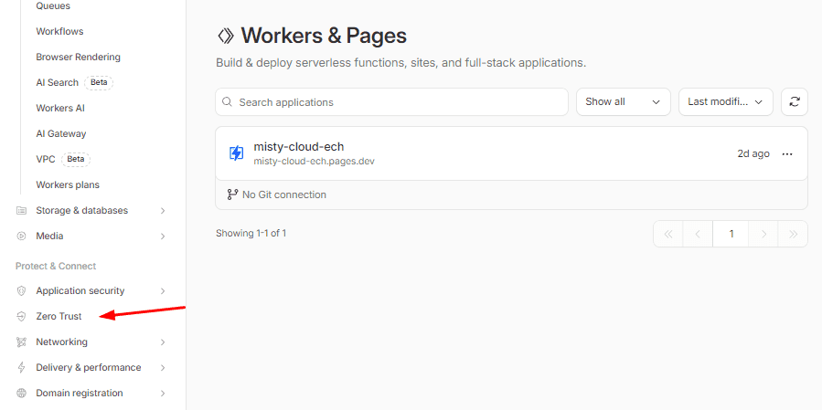 

 点这个

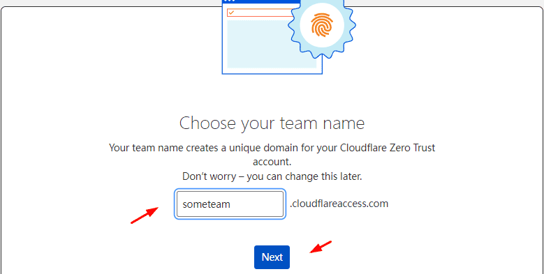 

选这个

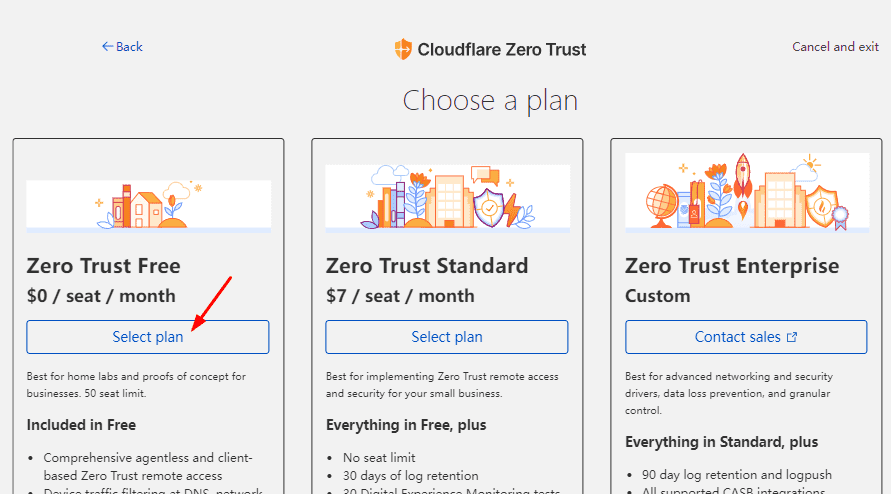 

点这个

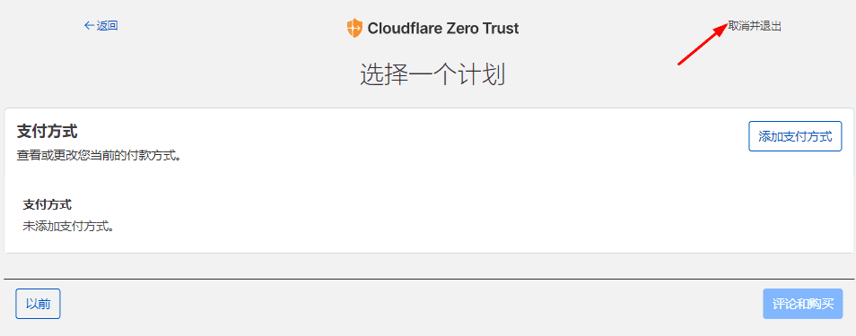 

继续点击**zero turst**

点击这个

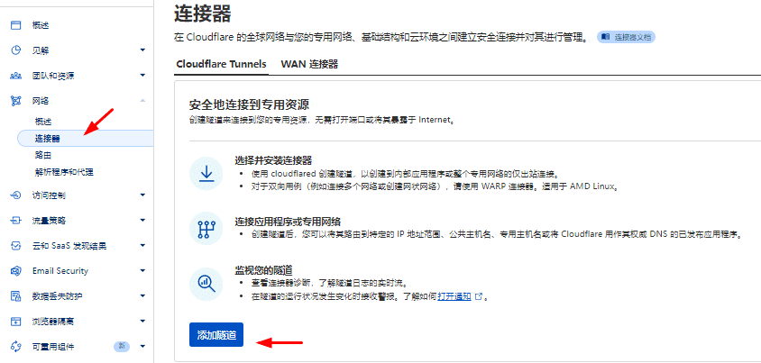 

点这个

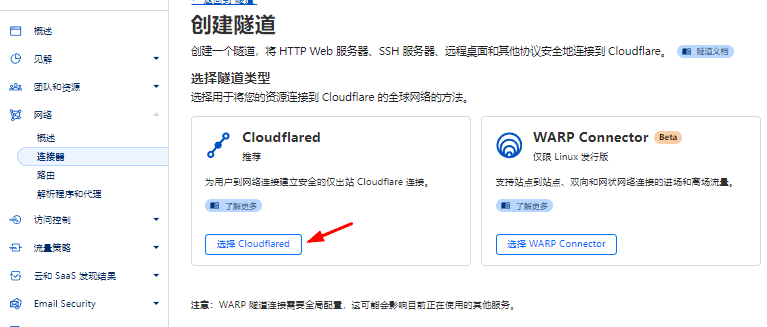 

点这个

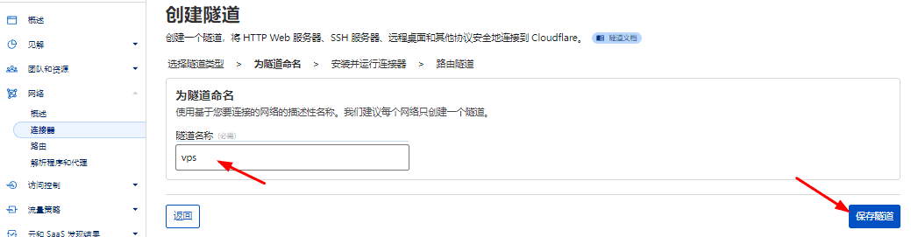 

复制密钥，下一步

**把密钥保存在一个临时文件，后边要用**

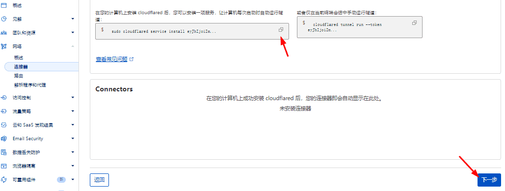 

点这个，添加域名到vps端口映射

> [!NOTE]
>
> > **第一个节点就：node1**
> >
> > **第二个节点就：node2**
> >
> > **........**
> >
> > **比如你使用s-ui面板，添加了vps节点**
> >
> > **开启了一个http类型的节点，监听端口443，就这样写：http://localhost:443**

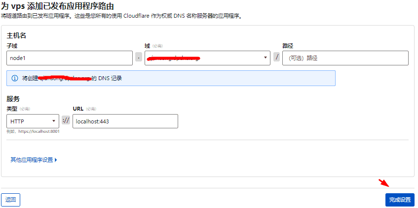 

之后要添加其它隧道节点，点这个

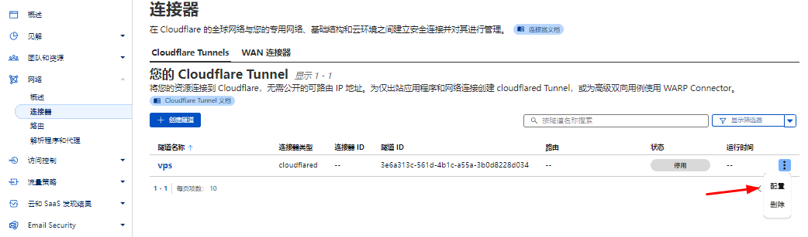 

安装隧道

```bash
#教程：https://amclubss.com/argo
bash <(curl -Ls https://raw.githubusercontent.com/amclubs/am-serv00-vmess/main/install-argo.sh)


╔══════════════════════════════════════════╗
║   🚀 数字套利 Cloudflare Argo 安装器        ║
╚══════════════════════════════════════════╝

\033[0;32m📺 YouTube频道： https://youtube.com/@am_clubs
\033[0;32m💬 TG交流群组： https://t.me/am_clubs
\033[0;32m💻 GitHub仓库： https://github.com/amclubs
\033[0;32m🌐 个人博客： https://amclubss.com
──────────────────────────────────────────
1) 安装 Argo Tunnel
2) 卸载 Argo Tunnel
3) 退出脚本

→ 请选择操作 (1/2/3): 1

🟢 进入安装流程...
Last metadata expiration check: 2:03:46 ago on Wed 31 Dec 2025 11:54:33 PM CST.
Package curl-7.76.1-34.el9.x86_64 is already installed.
Package wget-1.21.1-8.el9_4.x86_64 is already installed.
Dependencies resolved.
Nothing to do.
Complete!
→ 正在安装 cloudflared...
→ ✅ cloudflared 安装完成： /usr/local/bin/cloudflared
→ 检测到 cloudflared 版本：2025.11.1
  ✔ 新版 cloudflared 检测到，将启用新版兼容模式（不使用 --config 参数）

需要配置多少个域名->端口？(例如 2)： 1 #根据你面板配置的节点数，这里我选择1，我只配置了一个节点

#配置域名-入口-隧道-配置-已配置域名。复制粘贴
=== 配置第 1 个域名 ===
请输入要绑定的域名（Public Hostname）： node1.xxx.xxx.org #你的cloudflare隧道配置的节点域名
请输入本地监听端口（默认 443）： 443 #你的s-ui节点的端口

请选择传输方式：
1) WebSocket（默认）
2) gRPC
3) TCP
选择传输类型 (1/2/3，默认 1)： 1 #通常都是WebSocket
请输入 WebSocket 路径（默认 /）： / #通常也是/
请输入协议类型 (http/https/tcp，默认 http)： http #推荐http，根据节点不含tls，以及你的cloudflare隧道配置也是http

请选择凭证方式：
1) Cloudflare Token（推荐）
2) credentials JSON（直接粘贴内容）
选择 (1/2) 默认 1： 1 #Cloudflare Token（推荐）
请输入 Cloudflare Tunnel Token（以 eyJ 开头）： eyJh #你的cloudflare-(zere-trust)-入口-隧道-配置-已配置域名。复制粘贴

#报错
===========================================================================
✖ Cloudflared 启动失败！
------------------------------------------------------------
可能原因如下：
  [1] 凭证 Token 或 credentials JSON 无效（登录 Cloudflare Zero Trust 检查）
  [2] config.yml 格式错误（缩进或冒号错位）
  [3] 端口未开放 / 被占用（检查端口是否被其他进程使用）
  [4] 网络被防火墙或代理阻断（cloudflared 无法连接 Cloudflare）
------------------------------------------------------------
📋 快速排查命令：
  journalctl -u cloudflared -n 50 --no-pager
  systemctl status cloudflared
------------------------------------------------------------
❗ 解决后可执行： systemctl restart cloudflared

⚠️ 安装未成功，请先排查上述问题后重试。
==========================================================================

#编辑服务配置，去掉--config参数
[root@racknerd-0566bb5 ~]# cat /etc/systemd/system/cloudflared.service
[Unit]
Description=Cloudflare Tunnel Service
After=network-online.target

[Service]
Type=simple
ExecStart=/usr/local/bin/cloudflared tunnel run --token eyJh.....
Restart=on-failure
RestartSec=5s
User=root
WorkingDirectory=/root/.cloudflared

[Install]
WantedBy=multi-user.target

#重启服务
[root@racknerd-0566bb5 ~]# systemctl daemon-reload
[root@racknerd-0566bb5 ~]# systemctl restart cloudflared.service
```

显示这个，就打通了隧道

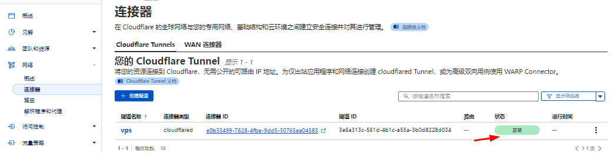 


### 5.6 客户端测试

客户端粘贴订阅地址，把服务器主机改为隧道节点  **node1.xxx.xxx.org**

端口：443

传输层加密：tls

访问油管成功：

 


## 6.被封IP怎么连接vps

### 6.1 前提条件

如果你的vps服务器IP地址被封，大陆没法直接  ssh 连接管理

你需要能够翻出去，clash , v2rayN , 寻找机场等等各种能让你出去的方式，海外云服务器也可以

或者配置本教程 **5步骤** 的隧道技术节点，终极防失联，使用它来代理 ssh 连接管理被墙的 vps **[强烈推荐]**

或者不跑路机场：[链接直达](https://mitce.net/aff.php?aff=26603)

海外云服务器不用多说，连接它直接就能用它  ssh  跳转连接你被墙的vps

**重点说一说如何：通过代理ssh连接被墙vps**

我们用 [雷电模拟器](https://www.ldmnq.com) 安装任意代理客户端，打开代理clash , v2rayN，[NekoBox下载](https://github.com/MatsuriDayo/NekoBoxForAndroid/releases/tag/1.4.0)，并使用 **[every-proxy](https://apkcombo.com/zh/every-proxy/com.gorillasoftware.everyproxy/download/phone-14.2-apk)** 软件，开放 `http` 代理端口 `8080` 以及 `socks5` 代理端口 `1080`

至此，准备工作结束，接着看下一步............

### 6.2 一般情况

🌀**一般http协议代理用途**

```bash
#临时配置环境变量
╰─ export http_proxy='http://192.168.1.150:8080'
╰─ export https_proxy='http://192.168.1.150:8080'
╰─ export all_proxy='socks5://192.168.1.150:1080'
╰─ export no_proxy='localhost,127.0.0.1,192.168.44.0/24,192.168.1.0/24'

#永久配置环境变量
╰─ vim ~/.zshrc   #shel是zsh的配置这个文件
╰─ vim ~/.bashrc  #shel是bash的配置这个文件

#添加如下4行到文件最后
export http_proxy='http://192.168.1.150:8080'
export https_proxy='http://192.168.1.150:8080'
export all_proxy='socks5://192.168.1.150:1080'
export no_proxy='localhost,127.0.0.1,192.168.44.0/24,192.168.1.0/24'

#或者创建函数，一劳永逸
╰─ vim ~/.zshrc
╰─ vim ~/.bashrc
=================================================================================
# set proxy on
proxy_on() {

    export http_proxy="http://192.168.1.150:8080"
    export https_proxy="http://192.168.1.150:8080"
    export all_proxy="socks5://192.168.1.150:1080"
    export no_proxy="localhost,127.0.0.1,192.168.44.0/24,192.168.1.0/24"
    echo "proxy on!"
}

# set proxy off
proxy_off() {

    unset http_proxy
    unset https_proxy
    unset all_proxy
    unset no_proxy
    echo "proxy off!"
}
=================================================================================

#生效配置
╰─ source ~/.zshrc
╰─ source ~/.bashrc

#开启代理
proxy_on

#关闭代理
proxy_off

#测试访问谷歌
╰─ curl google.com
<HTML><HEAD><meta http-equiv="content-type" content="text/html;charset=utf-8">
<TITLE>301 Moved</TITLE></HEAD><BODY>
<H1>301 Moved</H1>
The document has moved
<A HREF="http://www.google.com/">here</A>.
</BODY></HTML>
```

### 6.3 特殊情况

🌀**特殊用途**

**ssh能不能通过代理连接被墙的IP地址呢？**

可以，但**单纯设置环境变量（如 `all_proxy`）对 SSH 是无效的**。

这是因为 SSH 客户端（`ssh` 命令）设计得非常底层且追求安全，它默认**不会读取** `all_proxy` 或 `http_proxy` 环境变量。要让 SSH 走代理，你需要通过 **`ProxyCommand`** 或者 **`ProxyJump`** 来实现。

------

**方法一：使用 `nc` (Netcat) 或 `ncat` (最推荐)**

这是最通用的方法。通过 `ProxyCommand` 告诉 SSH：不要自己去连目标 IP，而是通过一个代理通道把流量传过去。

1. 如果你的代理是 SOCKS5：

```bash
#安装ncat
yum provides nc
yum install nmap-ncat

#通过代理ssh连接
ssh -o "ProxyCommand=ncat --proxy-type socks5 --proxy 192.168.1.150:1080 %h %p" root@你的被墙IP
```

- `--proxy-type`：指定使用 SOCKS5 协议。
- `--proxy 192.168.1.150:1080`：你的本地代理地址（模拟器地址）。
- `%h %p`：自动替换为目标主机名和端口。

2. 如果你的代理是 HTTP：

```bash
#安装ncat
yum provides nc
yum install nmap-ncat

#通过代理ssh连接
ssh -o "ProxyCommand=ncat --proxy-type http --proxy 192.168.1.150:8080 %h %p" root@你的被墙IP
```

- `--proxy-type`：指定使用 HTTP 协议。
- `--proxy 192.168.1.150:8080`：你的本地代理地址（模拟器地址）。
- `%h %p`：自动替换为目标主机名和端口。

------

**方法二：永久配置（一劳永逸）**

如果你不想每次都输入那么长的命令，可以修改你本地的 SSH 配置文件 `~/.ssh/config`：

1. 如果你的代理是 SOCKS5：

```bash
Host my-server
    HostName 1.2.3.4  # 被墙的 IP
    User root
    Port 22
    # 只要访问这个 Host，就自动走代理
    ProxyCommand ncat --proxy-type socks5 --proxy 192.168.1.150:1080 %h %p
```

设置后，你只需要执行：`ssh my-server` 即可。

2. 如果你的代理是 HTTP：

```bash
Host my-server
    HostName 1.2.3.4  # 被墙的 IP
    User root
    Port 22
    # 只要访问这个 Host，就自动走代理
    ProxyCommand ncat --proxy-type http --proxy 192.168.1.150:8080 %h %p
```

设置后，你只需要执行：`ssh my-server` 即可。

------

**方法三：使用 `ProxyJump` (如果你有另一台没被墙的服务器，比如海外云服务器)**

如果你没有本地代理工具，但有一台可以正常连接的“跳板机”（B服务器），可以通过它中转连接被墙的 A 服务器：

```bash
ssh -J userB@跳板机IP userA@被墙IP
```

- **原理**：流量先加密发送到跳板机，再由跳板机连接目标 IP。

------

常见问题排查

| **现象**               | **原因**           | **解决方法**                                                 |
| ---------------------- | ------------------ | ------------------------------------------------------------ |
| **找不到 nc 命令**     | 系统没装 `netcat`  | 安装：`sudo apt install netcat-openbsd` 或 `yum install nmap-ncat` |
| **Connection refused** | 代理没开启或端口错 | 检查 `ss -tunpl` 确认 1080 端口是否在监听。                  |
| **nc 不支持 -X 参数**  | 用的是传统 nc      | 尝试使用 `ncat` (nmap 自带) 替代。                           |

------

为什么 `all_proxy` 没用？

因为 SSH 使用的是自定义的加密二进制流，而 `all_proxy` 主要是为 HTTP/HTTPS 应用程序准备的。SSH 需要的是一个能透明转发原始 TCP 流的工具（如 `nc` 或 `ncat`）。

**你目前电脑上运行的代理工具（如 Clash 或 V2Ray）提供的本地端口是 SOCKS5 还是 HTTP？** 告诉我端口类型，我可以给你提供最准确的配置。

### 6.4 如何通过代理+隧道访问【被墙】面板

首先你需要一个Linux虚拟机比如： **VMware** ，如果有图形界面比如：**kali-Linux** （这种最简单了）

🌀**有图形界面的Linux虚拟机**

执行ssh隧道命令，在 **Linux里边** 浏览器访问：http://127.0.0.1:8080/app/  即可

```bash
=>  root @ 󰌽 almalinux: 󰉋 ~----------------------------------------------------------------------------------------------------------------------------------------
➜ ssh -N \
-L 127.0.0.1:8080:localhost:2095 \
-o "ProxyCommand=ncat --proxy-type socks5 --proxy 192.168.1.131:1080 %h %p" \
-o "ServerAliveInterval=60" \
-o "ServerAliveCountMax=3" root@1.2.3.4

#-N  --只干端口转发的活儿，不进入shell
#-L  --本地转发
#127.0.0.1:8080  --在本机Linux监听8080端口
#localhost:2095  --将远程服务器（1.2.3.4）视角下的 localhost:2095 映射过来，假设2095就是你的S-UI面板
#-o "ProxyCommand=ncat --proxy-type socks5 --proxy 192.168.1.131:1080 %h %p"  --你指定了ssh走192.168.1.131:1080的socks5代理
#-o "ServerAliveInterval=60"  --每 60 秒发一次心跳
#-o "ServerAliveCountMax=3"   --如果发了 3 次心跳都没有回应，自动断开连接（防止命令假死挂在那里）
#root@1.2.3.4  --你的被墙vps登录信息，root表示用户名，1.2.3.4表示IP地址
```

🌀**如果你的Linux没有图形界面，也不难**

执行这种ssh隧道命令，在 **Windows里边** 浏览器访问：http://192.168.44.201:8080/app/  即可

```bash
=>  root @ 󰌽 almalinux: 󰉋 ~----------------------------------------------------------------------------------------------------------------------------------------
➜ ssh -N \
-L 192.168.44.201:8080:localhost:2095 \
-o "ProxyCommand=ncat --proxy-type socks5 --proxy 192.168.1.131:1080 %h %p" \
-o "ServerAliveInterval=60" \
-o "ServerAliveCountMax=3" root@1.2.3.4
```

**命令详细介绍**

这是一个非常典型的 **“套娃”式命令**。它结合了 **SSH 隧道（本地端口转发）** 和 **SSH 代理跳转（通过 SOCKS5 代理）** 两个高级功能。

简单来说，这个命令的作用是：**通过一个内网代理服务器连接到一个被墙（或远程）的服务器，并把那个服务器上的 2095 端口映射到你本地电脑的 8080 端口。**

------

**1. 命令各部分拆解**

我们将这个长命令拆成三个逻辑部分来看：

| **组成部分**                     | **含义**         | **具体作用**                                                 |
| -------------------------------- | ---------------- | ------------------------------------------------------------ |
| **`ssh -N -L ...`**              | **本地端口转发** | **映射端口**。`-N` 表示不执行远程命令（不打开 shell），只负责转发。 |
| **`192.168.44.201:8080`**        | **本地监听地址** | 在你本地**Linux**电脑的 `192.168.44.201` 这个网卡的 `8080` 端口开启监听。 |
| **`localhost:2095`**             | **远程目标端口** | 将远程服务器（1.2.3.4）视角下的 `localhost:2095` 映射过来。  |
| **`-o "ProxyCommand=..."`**      | **代理跳转指令** | **连接方式**。告诉 SSH 不要直接连 1.2.3.4，而是先通过代理。  |
| **`ncat --proxy...`**            | **SOCKS5 代理**  | 使用 `192.168.1.131:1080` 这个 SOCKS5 代理作为跳板（**你的模拟器地址**）。 |
| **`-o "ServerAlive..."`**        | **心跳机制**     | 每 60 秒给服务器发个“在吗？”，防止因为长时间没操作被防火墙踢下线。 |
| **`-o "ServerAliveCountMax=3"`** | **心跳次数**     | 如果发了 3 次心跳都没有回应，自动断开连接（防止命令假死挂在那里）。 |
| **`root@1.2.3.4`**               | **目标服务器**   | 最终你要登录的、位于公网（**或被墙**）的服务器。             |

**2. 流量的“长途旅行”路径**

当你运行这条命令后，如果你在局域网另一台电脑访问 `http://192.168.44.201:8080`，流量是这样跑的：

1. **第一站（你的Windows电脑）**：流量进入该Linux电脑的 `8080` 端口。
2. **第二站（内网跳板）**：流量被塞进 `ncat`，发给内网代理 `192.168.1.131:1080`（SOCKS5）。
3. **第三站（公网穿越）**：代理服务器把这一团加密的数据发往公网服务器 `1.2.3.4`。
4. **终点（目标服务器内部）**：`1.2.3.4` 收到数据并解密，发现你要找它自己的 `2095` 端口，于是把数据转交给该端口的服务（比如一个管理后台）。

------

**3. 为什么要这样写？（实战场景）**

- **场景 A：绕过防火墙封锁** 你无法直接连接 `1.2.3.4`（可能被墙或被封），但 `192.168.1.131` 这台机器有权访问外网，所以你借它的通道“偷渡”出去。
- **场景 B：共享远程服务给同事** 你映射的不是 `127.0.0.1` 而是 `192.168.44.201`。这意味着**同局域网的其他同事**只要访问你的 IP:8080，就能看到服务器上的 2095 端口内容。
- **场景 C：访问受限的后台** 服务器上的 2095 端口可能只允许本地访问（Localhost only），通过 SSH 隧道，你成功骗过了服务器，让它以为请求是来自它内部的。

------

**4. 进阶建议**

- **后台运行**：如果你不希望这个命令一直霸占你的终端，可以加一个 **`-f`** 参数（如 `ssh -fN ...`），它会在后台运行。
- **查看状态**：如果想确认隧道是否还在，可以用 `ps aux | grep 'ssh'` 查看进程。
- **关闭隧道**：找到对应的进程号（PID），使用 `kill <PID>` 即可关闭。

**如果你现在访问 8080 端口却提示“连接失败”，通常是因为**

> - **远程服务器上的 2095 服务没启动，**
> - **或者2095不是监听在localhost上而是一个指定的IP，**
> - **或者你的代理服务器不支持中转 SSH 流量，**
> - **或者你的本地虚拟机防火墙没有开放8080端口，**
> - **或者你弄坏了什么东西。**

------

**<font color=red>5.为什么写跳板机地址用域名会报错？</font>**

```bash
=>  root @ 󰌽 almalinux: 󰉋 ~----------------------------------------------------------------------------------------------------------------------------------------
➜ cat /etc/hosts
127.0.0.1   localhost localhost.localdomain localhost4 localhost4.localdomain4
::1         localhost localhost.localdomain localhost6 localhost6.localdomain6

1.2.3.4 host.myusvps.com

=>  root @ 󰌽 almalinux: 󰉋 ~----------------------------------------------------------------------------------------------------------------------------------------
➜ ssh -N \
-L 192.168.44.201:8080:localhost:2095 \
-o "ProxyCommand=ncat --proxy-type socks5 --proxy 192.168.1.131:1080 %h %p" \
-o "ServerAliveInterval=60" \
-o "ServerAliveCountMax=3" root@host.myusvps.com
```

这个问题非常典型，原因在于 **`ncat`（代理工具）和 `ssh`（客户端）在域名解析上的“分工”不明确** 导致的。

简而言之：**你本地电脑认识这个域名，但负责帮你“跑腿”的代理服务器（192.168.1.131）不认识它。**

------

**1. 深度拆解：为什么域名会失败？**

当你按下回车时，发生了一场错误的“接力”：

> 1. **SSH 预处理**：SSH 看到你要连 `host.myusvps.com`。它准备好这个字符串，并准备执行 `ProxyCommand`。
> 2. **变量替换**：SSH 把参数 `%h` 替换成了字符串 `"host.myusvps.com"`，然后启动 `ncat`。
> 3. **ncat 发起代理请求**：`ncat` 连接到你的 SOCKS5 代理（192.168.1.131）。它对代理服务器说：“请帮我连接到 `host.myusvps.com` 的 22 端口”。
> 4. **代理服务器解析失败（关键点）**：
>    - **如果你在 `/etc/hosts` 写的解析**：代理服务器（192.168.1.131）是一个独立的设备或软件，它**读不到**你本地电脑的 `/etc/hosts` 文件。
>    - **如果域名是私有的/未生效的**：代理服务器会去公网 DNS（如 8.8.8.8）查找。如果查不到，代理服务器就会返回一个“主机不可达”的错误。
> 5. **握手失败**：`ncat` 无法建立连接，SSH 客户端随之报错 `kex_exchange_identification: Connection closed`。

------

**2. 为什么换成 IP 就好了？**

当你换成 IP（如 `1.2.3.4`）时：

> - `ncat` 告诉代理服务器：“请帮我连接到 `1.2.3.4`”。
> - IP 地址是物理存在的，**不需要解析**。代理服务器直接就能找到目标，隧道顺利打通。

------

**3. 如何在保留域名的同时修复它？**

如果你觉得记 IP 太痛苦，想用域名，有两种最科学的解决方法：

**方法 A：使用 SSH 配置文件（最推荐）**

在 `~/.ssh/config` 中，你可以利用 `Host` 别名功能。SSH 会在本地先将别名转换为 `HostName`（IP），再传给代理。

1. 编辑配置：`nano ~/.ssh/config`
2. 写入：

```bash
Host myvps
    HostName 1.2.3.4              # 这里填真实的 IP
    User root
    ProxyCommand ncat --proxy-type socks5 --proxy 192.168.1.131:1080 %h %p
    LocalForward 192.168.44.201:8080 localhost:2095
    ServerAliveInterval 60
    ServerAliveCountMax 3
```

3. 运行命令：**`ssh -N myvps`**

   此时 %h 会被自动替换为 1.2.3.4，ncat 拿到的直接就是 IP。

**方法 B：在命令中硬编码 IP**

如果你不想改配置，可以修改 `ProxyCommand` 里的变量，把 `%h` 手动改成 IP：

```bash
ssh -N \
-L 192.168.44.201:8080:localhost:2095 \
-o "ProxyCommand=ncat --proxy-type socks5 --proxy 192.168.1.131:1080 1.2.3.4 %p" \
-o "ServerAliveInterval=60" \
-o "ServerAliveCountMax=3" root@host.myusvps.com
```

------

**总结**

这个报错的本质是：**SOCKS5 代理默认会将域名解析权交给代理服务器（Remote DNS）**。

如果你本地的 `/etc/hosts` 里定义了一个只有你自己知道的域名，那么跨过代理时，这个域名就“失效”了。

**你的 `host.myusvps.com` 是在 `/etc/hosts` 里定义的“假域名”，还是已经在公网生效的真实域名？** 如果是真实的但依然报错，那说明你的代理服务器（192.168.1.131）的 DNS 配置可能有问题。

------

**6. 偷懒配置**

如果你经常需要建立这个隧道，建议修改 `~/.ssh/config`，把所有杂乱的参数都 **`“藏起来”`**：

1. 编辑文件：`nano ~/.ssh/config`
2. 写入以下内容：

```bash
#命令版
=>  root @ 󰌽 almalinux: 󰉋 ~----------------------------------------------------------------------------------------------------------------------------------------
➜ ssh -N \
-L 192.168.44.201:8080:localhost:2095 \
-o "ProxyCommand=ncat --proxy-type socks5 --proxy 192.168.1.131:1080 %h %p" \
-o "ServerAliveInterval=60" \
-o "ServerAliveCountMax=3" root@1.2.3.4

#配置文件版
=>  root @ 󰌽 almalinux: 󰉋 ~----------------------------------------------------------------------------------------------------------------------------------------
➜ vim ~/.ssh/config
===========================================================================================
Host host.my-vps-server.com
    # 1. 这里直接写死云服务器 IP，确保 ncat 拿到的是 IP 而不是域名
    HostName 1.2.3.4
    
    # 2. 你的云服务器 vps 登录用户名
    User root
    
    # 3. 代理配置：这里 %h 会被自动替换为上面的 1.2.3.4
    ProxyCommand ncat --proxy-type socks5 --proxy 192.168.1.131:1080 %h %p
    
    # 4. 本地端口转发：本地 8080 映射到远程 2095 ，注意：如果你希望局域网其他机器也能访问，保留 192.168.44.201 或具体的本地 IP
    LocalForward 192.168.44.201:8080 localhost:2095
    
    # 5. 保持连接活跃，防止被代理或防火墙踢下线
    ServerAliveInterval 60
    ServerAliveCountMax 3
===========================================================================================
```

3. **之后只需要运行一个超简单的命令：**

Bash即可开启 ssh 隧道

```bash
ssh -N host.my-vps-server.com
```

------

**你要不要试着执行一下带 `-f` 参数的版本？** 这样你执行完命令后，就可以继续在这个终端里做其他操作，而隧道会在后台默默运行。

```bash
ssh -fN host.my-vps-server.com
```

**查看状态**：如果想确认隧道是否还在，可以用 `ps aux | grep 'ssh'` 查看进程。

**关闭隧道**：找到对应的进程号（PID），使用 `kill <PID>` 即可关闭。

完结🎊🎊.........


## 7.服务器Linux怎么配置代理

**在安卓手机上：** 我们用 [雷电模拟器](https://www.ldmnq.com) 安装任意代理客户端，打开代理clash , v2rayN，[NekoBox下载](https://github.com/MatsuriDayo/NekoBoxForAndroid/releases/tag/1.4.0)，并使用 **[every-proxy](https://apkcombo.com/zh/every-proxy/com.gorillasoftware.everyproxy/download/phone-14.2-apk)** 软件，开放 `http` 代理端口 `8080` 以及 `socks5` 代理端口 `1080`，就能实现本地电脑 + VMware虚拟机里边的Linux电脑都能代理上网，***这是娱乐性的*** ，只需要你有 Windows 电脑，很好实现。

**在苹果手机上：** 可以使用 Shadowrocket (小火箭) —— 最推荐，App Store 地址： [Shadowrocket on App Store](https://apps.apple.com/us/app/shadowrocket/id932747118) ，仅在非中国区 App Store 提供。

**而在Linux上（真实云服务器）：** 我们该怎么配置代理？，***这一般是工作性质的，比如docker镜像拉取，npm软件源加速，pip安装加速等等*** ，不可能在云服务器安装一个雷电模拟器，虚拟化再套一个虚拟化？这不现实。


通常：在服务器，比如 AlmaLinux 上，我们可以手动安装代理客户端 [sing-box](https://github.com/SagerNet/sing-box/releases)，并针对 `Hysteria2` 进行内核加速优化，需要从安装、系统底层调优、配置三个维度入手，一旦配置好，服务器领域的其他机器只需要配置代理环境变量，IP地址指向该 AlmaLinux 的地址，就能使用代理上网。

```bash
# 我们假设服务器IP地址：192.168.1.150，当它配置好sing-box客户端，并启动，会自动监听8080代理端口

# 其他服务器配置代理，即可流畅科学上网
[root@almalinux ~]# export http_proxy='http://192.168.1.150:8080'
[root@almalinux ~]# export https_proxy='http://192.168.1.150:8080'
[root@almalinux ~]# export all_proxy='socks5://192.168.1.150:8080'
[root@almalinux ~]# export no_proxy='localhost,127.0.0.1,192.168.44.0/24,192.168.1.0/24'
```

------

### 7.1 安装 sing-box

**1.确认系统架构：**

```bash
# 通常输出 x86_64
[root@almalinux ~]# uname -m
```

**2.下载并安装：**

前往 [sing-box GitHub Releases](https://github.com/SagerNet/sing-box/releases) 获取指定版（以 1.12.17 为例）：

```bash
[root@almalinux ~]# cd /tmp
[root@almalinux /tmp]# curl -Lo sing-box_1.12.17_linux_x86_64.rpm https://github.com/SagerNet/sing-box/releases/download/v1.12.17/sing-box_1.12.17_linux_x86_64.rpm
[root@almalinux /tmp]# rpm -ivh sing-box_1.12.17_linux_x86_64.rpm
```

**注意：推荐就使用 `1.12.17` 这个版本，因为它更新太快了，可能导致本教程 `json` 配置文件一些选项被废弃，最终无法启动服务。**

如果你执意要使用最新版，请自行分析报错日志，丢给AI，让它帮你修改JSON配置。

------

### 7.2 内核参数优化

Hysteria2 基于 QUIC (UDP)，对内核的接收/发送缓冲区（Buffer）要求较高。

**1.创建优化配置文件：**

建议新建一个独立文件，不要直接改 `sysctl.conf`：

```bash
[root@almalinux /tmp]# sudo vim /etc/sysctl.d/sing-box.conf
```

**2.写入以下高性能参数**：

```bash
# 允许更大的 UDP 接收和发送缓冲区（对 Hysteria2 吞吐量至关重要）
net.core.rmem_max = 16777216
net.core.wmem_max = 16777216

# 提高 TCP 并发能力（虽然 Hy2 走 UDP，但系统基础环境建议优化）
net.ipv4.tcp_fastopen = 3

# 提高最大文件句柄数
fs.file-max = 1000000

# 提高单进程的最大文件限制（配合 sing-box 使用）
fs.nr_open = 1048576

# 提高默认缓冲区
net.core.rmem_default = 16777216
net.core.wmem_default = 16777216

# 启用 BBR 拥塞控制算法 (极大提升跨境传输速度)
net.core.default_qdisc = fq
net.ipv4.tcp_congestion_control = bbr
```

**3.应用配置**：

```bash
[root@almalinux /tmp]# sudo sysctl --system

# 验证参数
[root@almalinux /tmp]# sysctl -a|grep -E '(net.core.rmem_max =|net.core.wmem_max =|net.ipv4.tcp_fastopen =|fs.file-max|net.core.rmem_default =|net.core.wmem_default =|net.core.default_qdisc =|net.ipv4.tcp_congestion_control =|fs.nr_open =)'
fs.file-max = 1000000
fs.nr_open = 1048576
net.core.default_qdisc = fq
net.core.rmem_default = 16777216
net.core.rmem_max = 16777216
net.core.wmem_default = 16777216
net.core.wmem_max = 16777216
net.ipv4.tcp_congestion_control = bbr
net.ipv4.tcp_fastopen = 3
```

------

### 7.3 编写 sing-box 配置文件

将你的 Hysteria2 链接转换为 `config.json`。 **注意：** 不要泄露你的链接 `IP地址`，密码等重要信息， **否则会被他人盗用蹭网** 。

从 S-UI 面板复制链接后，你的链接通常如下： 

```bash
hysteria2://【密码】@【云服务器IP地址】:443?security=tls&insecure=1&sni=【伪装域名】&obfs=salamander&obfs-password=【混淆密码】&fastopen=0#hysteria2-19363
```

将它转为 `json` 配置，编辑 `/etc/sing-box/config.json`：

```bash
# 编辑配置，替换中文部分信息，改为你的真实的 Hysteria2 链接信息
[root@almalinux /tmp]# vim /etc/sing-box/config.json
{
  "log": {
    "level": "error",
    "timestamp": true
  },
  "dns": {
    "servers": [
      {
        "tag": "proxy-dns",
        "address": "https://8.8.8.8/dns-query"
      },
      {
        "tag": "local-dns",
        "address": "223.5.5.5"
      }
    ],
    "rules": [
      {
        "rule_set": "geosite-cn",
        "server": "local-dns"
      },
      {
        "query_type": ["A", "AAAA"],
        "server": "proxy-dns"
      }
    ],
    "final": "proxy-dns",
    "strategy": "prefer_ipv4"
  },
  "inbounds": [
    {
      "type": "mixed",
      "tag": "mixed-in",
      "listen": "::",
      "listen_port": 8080,
      "sniff": true,
      "sniff_override_destination": true
    }
  ],
  "outbounds": [
    {
      "type": "hysteria2",
      "tag": "proxy",
      "server": "你的云服务器IP地址",
      "server_port": 443,
      "password": "密码",
      // 宽带上行 100m
      "up_mbps": 100,
      // 宽带下行 300m
      "down_mbps": 300,
      "tls": {
        "enabled": true,
        "server_name": "伪装域名",
        "insecure": true
      },
      "obfs": {
        "type": "salamander",
        "password": "混淆密码"
      }
    },
    {
      "type": "direct",
      "tag": "direct"
    },
    {
      "type": "block",
      "tag": "block-out"
    }
  ],
  "route": {
    "rules": [
      {
        "protocol": "dns",
        "action": "hijack-dns"
      },
      // 1. 强制拦截这些域名（不管它解析出什么 IP）
      {
        "domain_suffix": [".bytedance.net", "ug.baidu.com"],
        "action": "route",
        "outbound": "block-out"
      },
      // 2. 强制国外核心域名走代理
      {
        "domain_keyword": [
          "google",
          "gstatic",
          "youtube",
          "facebook",
          "twitter"
        ],
        "action": "route",
        "outbound": "proxy"
      },
      // 3. 根据分流规则，绕过中国大陆网站
      {
        "rule_set": ["geoip-cn", "geosite-cn"],
        "action": "route",
        "outbound": "direct"
      },
      // 4. 把私有 IP 规则往后排，防止它误拦截了被污染的域名
      {
        "ip_is_private": true,
        "action": "route",
        "outbound": "direct"
      }
    ],
    "rule_set": [
      {
        "tag": "geosite-cn",
        "type": "local",
        "format": "binary",
        "path": "/var/lib/sing-box/geosite-cn.srs"
      },
      {
        "tag": "geoip-cn",
        "type": "local",
        "format": "binary",
        "path": "/var/lib/sing-box/geoip-cn.srs"
      }
    ],
    "final": "proxy",
    "auto_detect_interface": true,
    "default_domain_resolver": "local-dns"
  }
}
```

------

### 7.4 配置大陆白名单

**1.创建文件夹并赋权：**

```bash
[root@almalinux /tmp]# mkdir -p /var/lib/sing-box
[root@almalinux /tmp]# chown -R sing-box:sing-box /var/lib/sing-box
[root@almalinux /tmp]# ll /var/lib/sing-box -d
drwxr-xr-x 2 sing-box sing-box 48 Jan 18 22:49 /var/lib/sing-box
```

**2.下载中国大陆网站规则文件**

```bash
# 通常这需要梯子才能下载成功，可以本地开梯子下载，然后上传到服务器 /var/lib/sing-box/ 目录底下
[root@almalinux /tmp]# cd /var/lib/sing-box/
[root@almalinux /var/lib/sing-box]# wget https://raw.githubusercontent.com/SagerNet/sing-geoip/rule-set/geoip-cn.srs
[root@almalinux /var/lib/sing-box]# wget https://raw.githubusercontent.com/SagerNet/sing-geosite/rule-set/geosite-cn.srs

# 修改权限
[root@almalinux /var/lib/sing-box]# chown -R sing-box:sing-box ./
[root@almalinux /var/lib/sing-box]# ll
total 84
-rw-r--r-- 1 sing-box sing-box 33743 Jan 18 22:48 geoip-cn.srs
-rw-r--r-- 1 sing-box sing-box 48811 Jan 18 22:49 geosite-cn.srs
```

------

### 7.5 管理服务

**1.启动服务**：

```bash
# 检查配置文件格式，确保没有ERROR 等错误提示， WARN倒是是没关系
[root@almalinux /tmp]# /usr/bin/sing-box check -c /etc/sing-box/config.json
WARN[0000] legacy DNS servers is deprecated in sing-box 1.12.0 and will be removed in sing-box 1.14.0, checkout documentation for migration: https://sing-box.sagernet.org/migration/#migrate-to-new-dns-server-formats

# 启动服务
[root@almalinux /tmp]# sudo systemctl enable --now sing-box
```

**2.检查是否运行正常**：

```bash
# 查看状态
[root@almalinux /tmp]# sudo systemctl status sing-box

# 查看日志
[root@almalinux /tmp]# journalctl -u sing-box.service -f

# 如果日志报错，请丢给AI，调整JSON配置，然后重启服务
[root@almalinux /tmp]# sudo systemctl restart sing-box

# 如果一切没问题，应该正常监听8080端口
[root@almalinux /tmp]# ss -tulnp |grep -E '(Send-Q|:8080)' | awk '
BEGIN { fmt = "%-8s %-10s %-8s %-8s %-25s %-25s %-s\n" }
NR==1 { printf fmt, $1, $2, $3, $4, "Local Address:Port", "Peer Address:Port", "Process"; next }
{
    # 合并第7列之后的所有内容，防止进程名被截断
    process = ""; for(i=7; i<=NF; i++) process = process $i " "
    printf fmt, $1, $2, $3, $4, $5, $6, process
}'

# 命令输出应该是这样
Netid    State      Recv-Q   Send-Q   Local Address:Port        Peer Address:Port         Process
tcp      LISTEN     0        4096     *:8080                    *:*                       users:(("sing-box",pid=1180,fd=5))

# 测试代理（使用我们配置的 8080 端口），应该返回HTTP 200 状态码，表示代理成功
[root@almalinux /tmp]# curl --proxy http://127.0.0.1:8080 -I https://www.google.com
HTTP/1.1 200 Connection established

HTTP/2 200
content-type: text/html; charset=ISO-8859-1
```

------

### 7.6 其它机器配置代理

🌀**一般http协议代理用途**

```bash
#注意：此时http 和 socks5共用8080端口，不需要区分了，因为我们的JSON 配置是："mixed"

#临时配置环境变量
╰─ export http_proxy='http://192.168.1.150:8080'
╰─ export https_proxy='http://192.168.1.150:8080'
╰─ export all_proxy='socks5://192.168.1.150:8080'
╰─ export no_proxy='localhost,127.0.0.1,192.168.44.0/24,192.168.1.0/24'

#永久配置环境变量
╰─ vim ~/.zshrc   #shel是zsh的配置这个文件
╰─ vim ~/.bashrc  #shel是bash的配置这个文件

#添加如下4行到文件最后
export http_proxy='http://192.168.1.150:8080'
export https_proxy='http://192.168.1.150:8080'
export all_proxy='socks5://192.168.1.150:8080'
export no_proxy='localhost,127.0.0.1,192.168.44.0/24,192.168.1.0/24'

#或者创建函数，一劳永逸
╰─ vim ~/.zshrc
╰─ vim ~/.bashrc
=================================================================================
# set proxy on
proxy_on() {

    export http_proxy="http://192.168.1.150:8080"
    export https_proxy="http://192.168.1.150:8080"
    export all_proxy="socks5://192.168.1.150:8080"
    export no_proxy="localhost,127.0.0.1,192.168.44.0/24,192.168.1.0/24"
    echo "proxy on!"
}

# set proxy off
proxy_off() {

    unset http_proxy
    unset https_proxy
    unset all_proxy
    unset no_proxy
    echo "proxy off!"
}
=================================================================================

#生效配置
╰─ source ~/.zshrc
╰─ source ~/.bashrc

#开启代理
proxy_on

#关闭代理
proxy_off

#测试访问谷歌
╰─ curl -I https://www.google.com
<HTML><HEAD><meta http-equiv="content-type" content="text/html;charset=utf-8">
<TITLE>301 Moved</TITLE></HEAD><BODY>
<H1>301 Moved</H1>
The document has moved
<A HREF="http://www.google.com/">here</A>.
</BODY></HTML>
```

🌀**特殊代理用途**

请参见本教程【6.3】小节。

------

### 7.7 关键点提示

- **BBR 加速**：AlmaLinux 默认内核支持 BBR。如果执行 `sysctl net.ipv4.tcp_congestion_control` 显示不是 `bbr`，上述参数会自动开启它。
- **UDP 限制**：部分服务商会限制 UDP（QoS）。如果 Hy2 速度极慢，可能需要降低 `up_mbps` 和 `down_mbps` 或更改混淆方式。
- **192.168.1.150**：请再次确认你的 sing-box 客户端是否真的运行在该地址的服务器，如果不是，请将该 IP 改为你真实的服务器私有 IP，不要照抄。

**最后，享受~~~**


## 8.服务器内存消失之谜

这是一份为您定制的 **VPS 内存 “失踪” 排查与修复全手册**。我们以这台 RackNerd 的 1GB 内存 VPS 为例，结合您之前的排查实录，总结出这套防御性分析流程。

------

### 8.1 排查阶段一

**🟢 第一阶段：确定“失踪”规模（真假损耗）**

首先要区分是 **厂家没给够**，还是 **系统占用多**。

**1. 核心自白：`dmesg`**

这是内核启动时对物理内存的最初感知。

```bash
dmesg | grep -i "Memory:"
```

- **诊断结论**：如果你看到 `.../1048576K`（即 1024MB），说明 **厂家给够了**。
- **损耗计算**：`Total` 减去 `available` 的差额，就是内核代码、BIOS 预留和硬件映射占用的“固定成本”。

**2.查看内核认定的总额**

```bash
grep MemTotal /proc/meminfo
```

- **注意**：这是系统能调配的最大内存上限。如果这个数值远小于套餐（如 1G 套餐只有 700多MB），说明有巨大的“黑洞”切走了块状内存。

------

### 8.2 排查阶段二

**🔴 第二阶段：揪出“割肉”元凶（Kdump 崩溃转储）**

在 RHEL 9 / AlmaLinux 9 系统中，内存缩水最常见的元凶是 **Kdump**。

**1. 检查启动参数**

```bash
cat /proc/cmdline
```

- **危险信号**：如果看到 `crashkernel=1G-2G:192M`，意味着系统即便在 1GB 的小内存下，也要强行预留 **192MB** 给崩溃记录。这部分内存在 `free` 命令中完全不可见。

**2.验证预留位置**

```bash
dmesg | grep -i "crashkernel reserved"
```

- **实战案例**：您之前的记录显示 `(192 MB)` 被隔离，这就是导致 1G 内存变 765M 的核心原因。

------

### 8.3 排查阶段三

**🟡 第三阶段：精准修复（使用 `grubby`）**

在现代 RHEL 系系统中，手动修改 `grub.cfg` 容易失效，**`grubby`** 是官方推荐的“手术刀”。

**1. 移除预留限制**

```bash
# 查看所有内核参数
grubby --info=ALL

# 移除 crashkernel 参数，并再次添加该参数为 crashkernel=no
sudo grubby --update-kernel=ALL --remove-args="crashkernel=1G-2G:192M,2G-64G:256M,64G-:512M"
sudo grubby --update-kernel=ALL --args="crashkernel=no"

# 验证是否修改成功
grubby --info=ALL
```

**2. 彻底禁用 kdump 服务**

```bash
sudo systemctl disable --now kdump
```

------

### 8.4 排查阶段四

**🔵 第四阶段：深度扫描（细碎占用排查）**

如果内存依然不达标，需要看谁在“偷吃”：

**1.巨页内存 (HugePages)**

```bash
grep -i "Huge" /proc/meminfo
```

- **Anonymous HugePages**：如果开启了透明巨页，会有小额内存（如 32MB）被打包。

**2. 内核缓存 (Slab)**

```bash
slabtop -o -s a | head -n 15
```

- **分析**：查看文件节点缓存（dentry, inode）是否占用了过量内存。

**3. 进程排行**

```bash
ps aux --sort=-rss | head -n 10
```

------

### 8.5 最终体检总结

| **检查项**           | **您的数据** | **状态**   | **结论**                          |
| -------------------- | ------------ | ---------- | --------------------------------- |
| **物理总量**         | 1048036K     | ✅ 正常     | 厂家 RackNerd 物理分配足额 1024MB |
| **Kdump 预留**       | 192MB        | ❌ 异常     | 已通过 `grubby` 成功释放          |
| **内核代码占用**     | 16MB         | ✅ 正常     | AlmaLinux 9 核心运行必需空间      |
| **最终可用 (Total)** | **956MB**    | ✅ **满血** | 已达到 1G VPS 的理论极限利用率    |

------

**下一步建议：**

既然内存已经“颗粒归仓”，我们可以继续完成之前的 **网卡改名 (eth0)** 操作，或者为您配置一个 **1GB 的 Swap 文件**，作为内存溢出时的防御性缓冲。需要我帮您写出这两项操作的命令吗？
